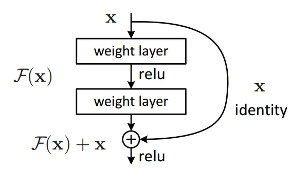
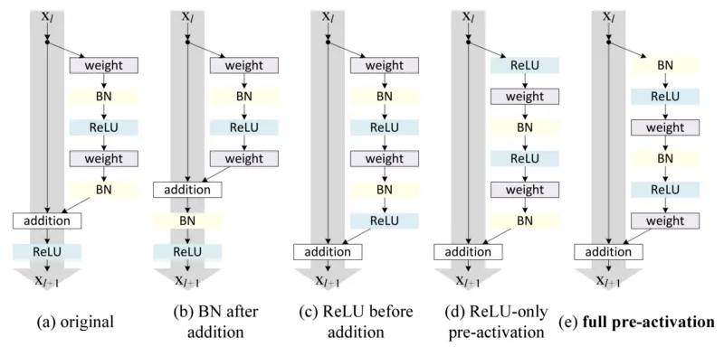

# Residual blocks — Building blocks of ResNet

理解残差块其实很简单。在传统神经网络中，每一层的输出都会传递到下一层。而在包含残差块的网络中，每一层不仅将输出传递到下一层，还会直接传递给相隔 2–3 层的后续层。就是这样。
但要真正理解为什么最初需要它、它为什么如此重要，以及它与一些其他先进架构的相似之处，这才是我们接下来要关注的重点。关于为什么残差块如此优秀、以及它是如何成为让神经网络在广泛任务中取得最先进性能的关键思想之一，其实有不止一种解释。
在深入细节之前，这里先给出一张残差块的示意图，帮助你直观地了解它的结构。

我们知道，神经网络是通用函数逼近器，并且随着网络层数的增加，准确率也会提高。但层数增加到一定程度后，准确率提升会遇到瓶颈。既然神经网络是通用函数逼近器，那它本应能够学习任何简单或复杂的函数。然而，受困于梯度消失和维度灾难等问题，当网络足够深时，它甚至可能无法学习像恒等函数这样简单的函数。这显然是不可取的。

此外，如果我们不断增加网络层数，会发现准确率在某个点会趋于饱和，并最终下降。而且，这通常不是由过拟合引起的。因此，看起来浅层网络的学习效果反而优于更深层的网络，这有些反直觉。但这正是实践中观察到的现象，并且这种现象被广泛称为**退化问题（degradation problem）**。

在不深究退化问题以及深度神经网络无法学习恒等函数的具体根因之前，我们先来思考一些可能的解决方案。在退化问题中，我们知道浅层网络的性能优于仅多加了几层的深层网络。那么，为什么不直接跳过这些额外的层，至少让性能与浅层子网络持平呢？但是，要如何跳过这些层呢？

你可以通过跳跃连接（skip connections）**或**残差连接（residual connections）**来跳过部分层的训练。这正是我们在上图中看到的结构。事实上，如果仔细观察，你会发现仅依靠跳跃连接，我们就能直接学习一个恒等函数。这正是为什么跳跃连接也被称为**恒等快捷连接（identity shortcut connections）的原因——一个方案，解决所有问题！

但是，为什么叫它“残差（residual）”呢？“残差”又在哪里？现在，是时候让我们内心的数学家出场了。假设我们有一个神经网络块，它的输入是 $x$，而我们希望学习到真实的分布 $H(x)$。我们定义它们之间的差（即残差）为：

$$
R(x) = \text{Output} - \text{Input} = H(x) - x
$$

将其重新排列，可以得到：

$$
H(x) = R(x) + x
$$

我们的残差块整体上就是在尝试学习真实输出 $H(x)$。如果仔细看上面的图，你会发现，由于有一条从 $x$ 直接传递的恒等连接，这些层实际上是在学习残差 $R(x)$。
所以，总结来说：**传统网络**中的层在学习真实输出 $H(x)$，而**残差网络**中的层在学习残差 $R(x)$。这也正是名字“Residual Block（残差块）”的由来。

还有研究发现，相比只学习输入本身，学习**输出与输入的残差**更容易。作为额外的好处，我们的网络只需将残差设为零，就能直接学习到恒等函数。

如果你真正理解反向传播，并且知道随着网络层数增加，梯度消失问题会变得多么严重，那么你就会很清楚地看到：由于这些跳跃连接（skip connections）的存在，我们可以将更大的梯度传回到初始层，使这些初始层的学习速度与最后几层相当，从而具备训练更深网络的能力。

下图展示了如何排列残差块与恒等连接，以实现最佳的梯度流动效果。研究发现，带有批归一化（Batch Normalization）的预激活（pre-activation）通常能带来最佳效果（也就是说，图中最右侧的残差块结构往往表现最优）。

