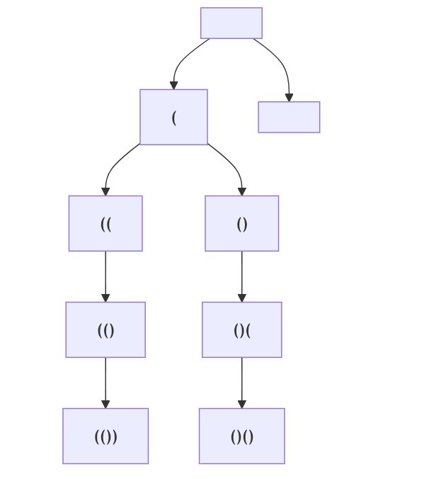
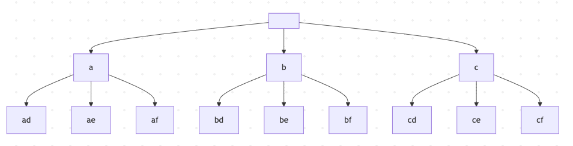

- [Recursion / Backtracking](#recursion--backtracking)
  - [22. Generate Parentheses 括号生成 中等](#22-generate-parentheses-括号生成-中等)
  - [17.  Letter Combinations of a Phone Number 电话号码的字母组合 中等](#17--letter-combinations-of-a-phone-number-电话号码的字母组合-中等)

# Recursion / Backtracking

> 我的心得
>
> 要会画树，回溯一旦会画树，就基本上解决问题了。

题目列表
<ol>
<li>22. Generate Parentheses 括号生成 中等</li>
<li>77. Combinations 组合 中等 元素无重不可复选</li>
</ol>

## 22. Generate Parentheses 括号生成 中等

数字 n 代表生成括号的对数，请你设计一个函数，用于能够生成所有可能的并且 有效的 括号组合。

示例 1：

> 输入：n = 3
>
> 输出：["((()))","(()())","(())()","()(())","()()()"]

示例 2：

> 输入：n = 1
>
> 输出：["()"]
 

提示：

> - 1 <= n <= 8

```
class Solution {
    List<String> res = new ArrayList<>();
    StringBuilder track = new StringBuilder();

    public List<String> generateParenthesis(int n) {
        backtrack(n, 0, 0);
        return res;      
    }

    void backtrack(int n, int open, int close) {
        // 触发结束条件：当前字符串长度达到 2n
        if (track.length() == n * 2) {
            res.add(track.toString());
            return;
        }

        // open < n 排除不合法的选择
        if (open < n) {
            track.append("(");  // 做选择
            backtrack(n, open + 1, close);  // 进入下一层决策树
            track.deleteCharAt(track.length() - 1);     // 取消选择
        }

        // close < open 排除不合法的选择
        if (close < open) {
            track.append(")");  // 做选择
            backtrack(n, open, close + 1);  // 进入下一层决策树
            track.deleteCharAt(track.length() - 1);     // 取消选择
        }
    }
}
```




## 17.  Letter Combinations of a Phone Number 电话号码的字母组合 中等

给定一个仅包含数字 2-9 的字符串，返回所有它能表示的字母组合。答案可以按 **任意顺序** 返回。

给出数字到字母的映射如下（与电话按键相同）。注意 1 不对应任何字母。


 

示例 1：

> 输入：digits = "23"
>
> 输出：["ad","ae","af","bd","be","bf","cd","ce","cf"]

示例 2：

> 输入：digits = ""
>
> 输出：[]

示例 3：

> 输入：digits = "2"
> 
> 输出：["a","b","c"]
 

提示：

> - 0 <= digits.length <= 4
>
> - digits[i] 是范围 ['2', '9'] 的一个数字。

```
class Solution {
    private static final String[] LETTERS = {"", "", "abc", "def", "ghi", "jkl", "mno", "pqrs", "tuv", "wxyz"};

    public List<String> letterCombinations(String digits) {
        List<String> res = new ArrayList<>();
        if (digits == null || digits.isEmpty()) {
            return res;
        }
        backtrack(res, digits, new StringBuilder(), 0);
        return res;   
    }

    void backtrack(List<String> res, String digits, StringBuilder path, int index) {
        if (index == digits.length()) {
            res.add(path.toString());
            return;
        }

        String letters = LETTERS[digits.charAt(index) - '0'];
        for (char c : letters.toCharArray()) {
            path.append(c);
            backtrack(res, digits, path, index + 1);
            path.deleteCharAt(path.length() - 1);
        }
    }
}
```

复杂度分析

时间复杂度：O(n4^n)，其中 n 为 digits 的长度。最坏情况下每次需要枚举 4 个字母，递归次数为一个满四叉树的节点个数，那么一共会递归 O(4^n)次（等比数列和），再算上加入答案时复制 path 需要 O(n) 的时间，所以时间复杂度为 O(n4^n)。

空间复杂度：O(n)。返回值的空间不计。



