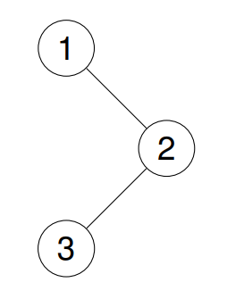
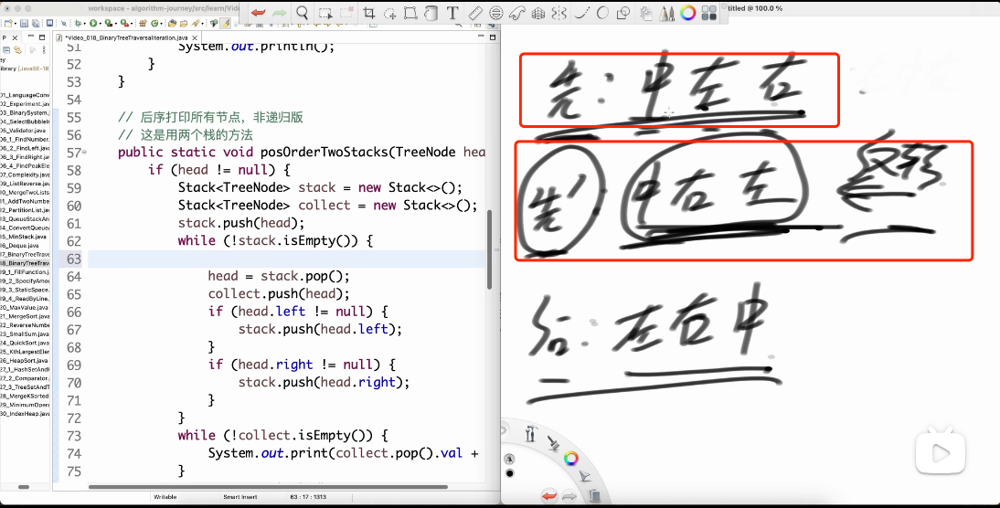

# 二叉树前序、中序、后序的递归遍历和迭代遍历

  * [144. Binary Tree Preorder Traversal 二叉树的前序遍历 简单](#144-binary-tree-preorder-traversal------------)
    + [递归](#--)
    + [迭代](#--)
  * [94. Binary Tree Inorder Traversal 二叉树的中序遍历 简单](#94-binary-tree-inorder-traversal------------)
    + [递归](#---1)
    + [迭代](#---1)
  * [145. Binary Tree Postorder Traversal 二叉树的后序遍历 简单](#145-binary-tree-postorder-traversal------------)
    + [递归](#---2)
    + [迭代](#---2)

参考了左程云的视频讲解
- [【算法讲解017【入门】二叉树及其三种序的递归实现】](https://www.bilibili.com/video/BV12p4y1V728/?share_source=copy_web&vd_source=59203eaa2a5b43acef991f52c90c9743)
- [【算法讲解018【入门】二叉树遍历的非递归实现和复杂度分析】 ](https://www.bilibili.com/video/BV15P411t7e2/?share_source=copy_web&vd_source=59203eaa2a5b43acef991f52c90c9743)
- [【算法讲解036【必备】二叉树高频题目-上-不含树型dp】](https://www.bilibili.com/video/BV1Rp4y1g7ys/?share_source=copy_web&vd_source=59203eaa2a5b43acef991f52c90c9743)
- [【算法讲解037【必备】二叉树高频题目-下-不含树型dp】](https://www.bilibili.com/video/BV1194y16727/?share_source=copy_web&vd_source=59203eaa2a5b43acef991f52c90c9743)
- [左程云 递归代码](https://github.com/algorithmzuo/algorithm-journey/blob/main/src/class017/BinaryTreeTraversalRecursion.java)
- [左程云 迭代代码](https://github.com/algorithmzuo/algorithm-journey/blob/main/src/class018/BinaryTreeTraversalIteration.java)

labuladong p73 也讲得不错

## 144. Binary Tree Preorder Traversal 二叉树的前序遍历 简单

给你二叉树的根节点 root ，返回它节点值的 **前序** 遍历。
 
示例 1：

> 输入：root = [1,null,2,3]
>
> 输出：[1,2,3]
>
> 解释：
>
> 
> 

示例 2：

> 输入：root = [1,2,3,4,5,null,8,null,null,6,7,9]
> 
> 输出：[1,2,4,5,6,7,3,8,9]
> 
> 解释：
>
> 
> 

示例 3：

> 输入：root = []
> 
> 输出：[]

示例 4：

> 输入：root = [1]
> 
> 输出：[1]

提示：

- 树中节点数目在范围 [0, 100] 内
- -100 <= Node.val <= 100
 
**进阶：** 递归算法很简单，你可以通过迭代算法完成吗？

### 递归

```
// labuladong p72
class Solution {
    List<Integer> res = new ArrayList<>();

    public List<Integer> preorderTraversal(TreeNode root) {
        traverse(root);
        return res;
    }

    // 没有返回值的函数命名为 void traverse()
    void traverse(TreeNode root) {
        if (root == null) {
            return;
        }

        // 前序位置
        res.add(root.val);
        traverse(root.left);
        traverse(root.right);
    }
}
```

### 迭代

```
class Solution {
    public List<Integer> preorderTraversal(TreeNode root) {
        List<Integer> res = new ArrayList<>();
        if (root == null) {
            return res;
        }
        
        Deque<TreeNode> stack = new ArrayDeque<>();
        stack.push(root);
        while (!stack.isEmpty()) {
            TreeNode curr = stack.pop();
            res.add(curr.val);
            if (curr.right != null) {
                stack.push(curr.right);
            }
            if (curr.left != null) {
                stack.push(curr.left);
            }          
        } 
        return res;       
    }
}
```

## 94. Binary Tree Inorder Traversal 二叉树的中序遍历 简单

给定一个二叉树的根节点 root ，返回 它的 **中序** 遍历 。

示例 1：

>  
>
> 输入：root = [1,null,2,3]
> 
> 输出：[1,3,2]

示例 2：

> 输入：root = []
> 
> 输出：[]

示例 3：

> 输入：root = [1]
> 
> 输出：[1]
 
提示：

- 树中节点数目在范围 [0, 100] 内
- -100 <= Node.val <= 100
 
**进阶:** 递归算法很简单，你可以通过迭代算法完成吗？

### 递归

```
class Solution {
    List<Integer> res = new ArrayList<>();

    public List<Integer> inorderTraversal(TreeNode root) {
        traverse(root);
        return res;
    }

    // 没有返回值的函数命名为 void traverse()
    void traverse(TreeNode root) {
        if (root == null) {
            return;
        }

        traverse(root.left);
        // 中序位置
        res.add(root.val);        
        traverse(root.right);
    }    
}
```

### 迭代

```
class Solution {
    public List<Integer> inorderTraversal(TreeNode root) {
        List<Integer> res = new ArrayList<>();
        Deque<TreeNode> stack = new ArrayDeque<>();
        TreeNode curr = root;
        while (curr != null || !stack.isEmpty()) {
            if (curr != null) {
                stack.push(curr);
                curr = curr.left;
            } else {
                curr = stack.pop();
                res.add(curr.val);
                curr = curr.right;
            }
        }   
        return res;
    }
}
```

## 145. Binary Tree Postorder Traversal 二叉树的后序遍历 简单

给你一棵二叉树的根节点 root ，返回其节点值的 **后序遍历** 。

示例 1：

> 输入：root = [1,null,2,3]
>
> 输出：[3,2,1]
> 
> 解释：
>
> 
> 

示例 2：

> 输入：root = [1,2,3,4,5,null,8,null,null,6,7,9]
>
> 输出：[4,6,7,5,2,9,8,3,1]
>
> 解释：
>
> 
> 

示例 3：

> 输入：root = []
>
> 输出：[]

示例 4：

> 输入：root = [1]
>
> 输出：[1]

提示：

- 树中节点的数目在范围 [0, 100] 内
- -100 <= Node.val <= 100
 
**进阶：** 递归算法很简单，你可以通过迭代算法完成吗？

### 递归

```
class Solution {
    List<Integer> res = new ArrayList<>();

    public List<Integer> postorderTraversal(TreeNode root) {
        traverse(root);
        return res;  
    }

    // 二叉树遍历函数
    // 没有返回值的函数命名为 void traverse()
    void traverse(TreeNode root) {
        if (root == null) {
            return;
        }    

        traverse(root.left);
        traverse(root.right);
        // 后序位置
        res.add(root.val);
    }
}
```

### 迭代



需要参考先序：
- 先序： 中 左 右
- 先序': 中 右 左 
- 先序'反转得到后序
- 后序： 左 右 中

一句话，会了先序的迭代，就会了后序的迭代，只不过后序使用了两个stack，第二个stack用来反转。

[左程云](https://github.com/algorithmzuo/algorithm-journey/blob/main/src/class018/BinaryTreeTraversalIteration.java)

左程云这个地方讲解的比较清楚
[【算法讲解018【入门】二叉树遍历的非递归实现和复杂度分析】 【精准空降到 22:58】](https://www.bilibili.com/video/BV15P411t7e2/?share_source=copy_web&vd_source=59203eaa2a5b43acef991f52c90c9743&t=1378)

```
class Solution {
    public List<Integer> postorderTraversal(TreeNode root) {
        List<Integer> res = new ArrayList<>();
        if (root == null) {
            return res;
        }

        Deque<TreeNode> stack = new ArrayDeque<>();
        Deque<TreeNode> collect = new ArrayDeque<>();
        stack.push(root);
        while (!stack.isEmpty()) {
            TreeNode curr = stack.pop();
            collect.push(curr);
            if (curr.left != null) {
                stack.push(curr.left);
            }
            if (curr.right != null) {
                stack.push(curr.right);
            }
        }
        while (!collect.isEmpty()) {
            res.add(collect.pop().val);
        }
        return res;
    }
}
```

