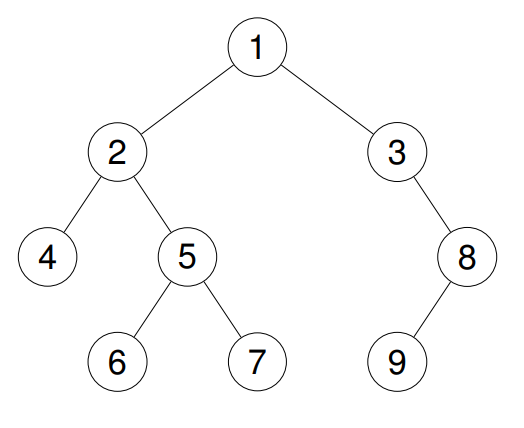

二叉树前、中、后三种递归遍历和迭代遍历

题目列表
| 题目      | 备注 |
| ----------- | ----------- |
|144. Binary Tree Preorder Traversal 二叉树的前序遍历 简单|        |
|207. Course Schedule 课程表 中等| 和 210. Course Schedule II 相似，只是返回 true 或者 false|
|269. Alien Dictionary 火星词典 困难 |         |


## 144. Binary Tree Preorder Traversal 二叉树的前序遍历 简单

给你二叉树的根节点 root ，返回它节点值的 **前序** 遍历。
 

示例 1：

> 输入：root = [1,null,2,3]
>
> 输出：[1,2,3]
>
> 解释：

 


示例 2：

> 输入：root = [1,2,3,4,5,null,8,null,null,6,7,9]
> 
> 输出：[1,2,4,5,6,7,3,8,9]
> 
> 解释：

 


示例 3：

> 输入：root = []
> 
> 输出：[]

示例 4：

> 输入：root = [1]
> 
> 输出：[1]

提示：

- 树中节点数目在范围 [0, 100] 内
- -100 <= Node.val <= 100
 

**进阶：** 递归算法很简单，你可以通过迭代算法完成吗？

**非递归版**
```
class Solution {
    public List<Integer> preorderTraversal(TreeNode root) {
        List<Integer> res = new ArrayList<>();
        if (root == null) {
            return res;
        }
        
        Deque<TreeNode> stack = new ArrayDeque<>();
        stack.push(root);
        while (!stack.isEmpty()) {
            TreeNode curr = stack.pop();
            res.add(curr.val);
            if (curr.right != null) {
                stack.push(curr.right);
            }
            if (curr.left != null) {
                stack.push(curr.left);
            }          
        } 
        return res;       
    }
}
```
