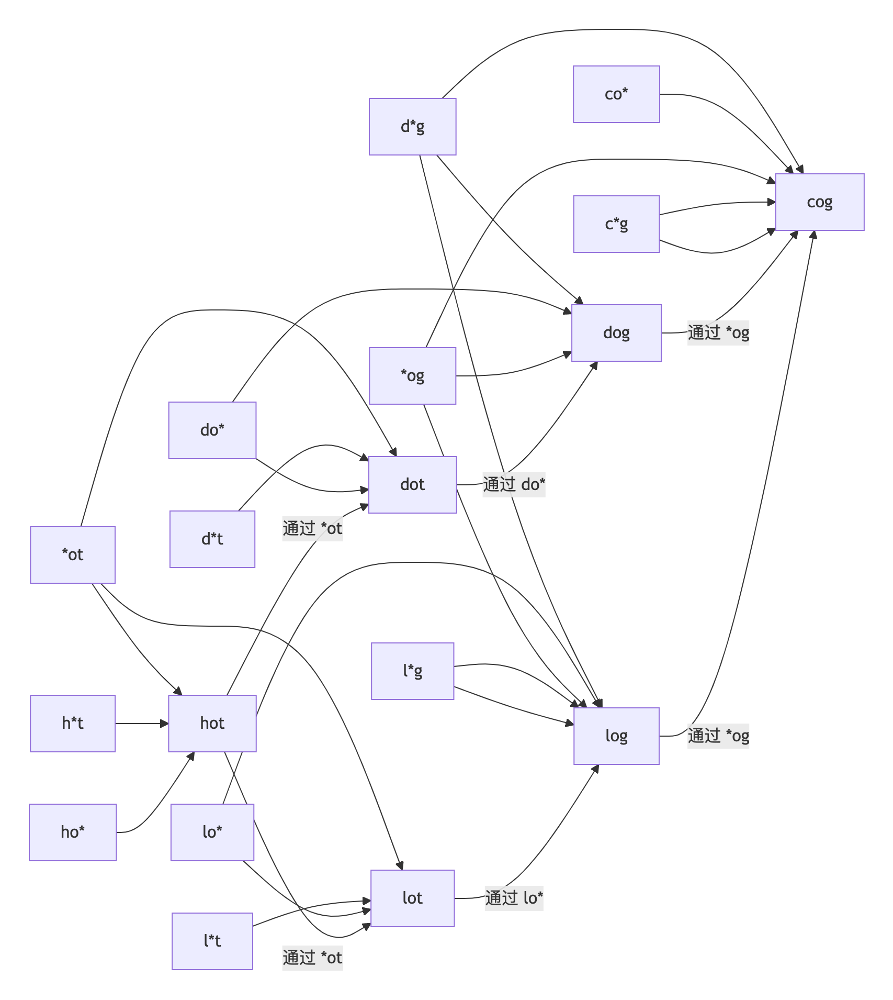

# Graph Traversal - DFS, BFS, Topological Sorting

题目列表

133. Clone Graph 克隆图 中等
127. Word Ladder 单词接龙 困难

## 133. Clone Graph 克隆图 中等

给你无向 **连通** 图中一个节点的引用，请你返回该图的 **深拷贝**（克隆）。

图中的每个节点都包含它的值 val（int） 和其邻居的列表（list[Node]）。

```
class Node {
    public int val;
    public List<Node> neighbors;
}
```

测试用例格式：

简单起见，每个节点的值都和它的索引相同。例如，第一个节点值为 1（val = 1），第二个节点值为 2（val = 2），以此类推。该图在测试用例中使用邻接列表表示。

**邻接列表** 是用于表示有限图的无序列表的集合。每个列表都描述了图中节点的邻居集。

给定节点将始终是图中的第一个节点（值为 1）。你必须将 给定节点的拷贝 作为对克隆图的引用返回。

 


示例 1：

> 输入：adjList = [[2,4],[1,3],[2,4],[1,3]]
>
> 输出：[[2,4],[1,3],[2,4],[1,3]]
>
> 解释：
>
> 图中有 4 个节点。
>
> 节点 1 的值是 1，它有两个邻居：节点 2 和 4 。
>
> 节点 2 的值是 2，它有两个邻居：节点 1 和 3 。
>
> 节点 3 的值是 3，它有两个邻居：节点 2 和 4 。
>
> 节点 4 的值是 4，它有两个邻居：节点 1 和 3 。

示例 2：

> 输入：adjList = [[]]
>
> 输出：[[]]
>
> 解释：输入包含一个空列表。该图仅仅只有一个值为 1 的节点，它没有任何邻居。

示例 3：

> 输入：adjList = []
> 
> 输出：[]
>
>解释：这个图是空的，它不含任何节点。
 
提示：

> - 这张图中的节点数在 [0, 100] 之间。
> 
> - 1 <= Node.val <= 100
>
> - 每个节点值 Node.val 都是唯一的，
>
> - 图中没有重复的边，也没有自环。
> 
> - 图是连通图，你可以从给定节点访问到所有节点。


### DFS（深度优先搜索）
思路：
1. 使用哈希表存储原节点和克隆节点的映射。
2. 递归克隆每个节点及其邻居。

- 时间复杂度：O(N)，其中 N 是图中的节点数。
- 空间复杂度：O(N)，哈希表存储所有节点的克隆。

```
class Solution {
    private Map<Node, Node> visited = new HashMap<>();

    public Node cloneGraph(Node node) {
        if (node == null) {
            return null;
        }    

        if (visited.containsKey(node)) {
            return visited.get(node);
        }

        Node clone = new Node(node.val);
        visited.put(node, clone);
        for (Node nei : node.neighbors) {
            clone.neighbors.add(cloneGraph(nei));
        }

        return clone;
    }
}
```

### BFS（广度优先搜索）
思路：
1. 使用队列进行层次遍历。
2. 哈希表存储原节点和克隆节点的映射。

- 时间复杂度：O(N)。
- 空间复杂度：O(N)，哈希表和队列的空间。

```
class Solution {
    public Node cloneGraph(Node node) {
        if (node == null) {
            return null;
        }

        Map<Node, Node> visited = new HashMap<>();
        Queue<Node> q = new LinkedList<>();
        q.offer(node);
        // 克隆第一个节点并存储到哈希表中
        visited.put(node, new Node(node.val));

        while (!q.isEmpty()) {
            Node curr = q.poll();
            for (Node neighbor : curr.neighbors) {
                if (!visited.containsKey(neighbor)) {
                    // 如果没有被访问过，就克隆并存储在哈希表中
                    visited.put(neighbor, new Node(neighbor.val));
                    // 将邻居节点加入队列中
                    q.offer(neighbor);
                }
                // 更新当前节点的邻居列表
                visited.get(curr).neighbors.add(visited.get(neighbor));
            }
        }
        return visited.get(node);
    }
}
```

## 127. Word Ladder 单词接龙 困难

字典 wordList 中从单词 beginWord 到 endWord 的 **转换序列** 是一个按下述规格形成的序列 beginWord -> s<sub>1</sub> -> s<sub>2</sub> -> ... -> s<sub>k</sub>：

- 每一对相邻的单词只差一个字母。
- 对于 1 <= i <= k 时，每个 si 都在 wordList 中。注意， beginWord 不需要在 wordList 中。
- s<sub>k</sub> == endWord

给你两个单词 beginWord 和 endWord 和一个字典 wordList ，返回 从 beginWord 到 endWord 的 **最短转换序列** 中的 **单词数目** 。如果不存在这样的转换序列，返回 0 。

 
示例 1：

> 输入：beginWord = "hit", endWord = "cog", wordList = ["hot","dot","dog","lot","log","cog"]
> 
> 输出：5
> 
> 解释：一个最短转换序列是 "hit" -> "hot" -> "dot" -> "dog" -> "cog", 返回它的长度 5。

示例 2：

> 输入：beginWord = "hit", endWord = "cog", wordList = ["hot","dot","dog","lot","log"]
> 
> 输出：0
> 
> 解释：endWord "cog" 不在字典中，所以无法进行转换。
 
提示：

> - 1 <= beginWord.length <= 10
> 
> - endWord.length == beginWord.length
> 
> - 1 <= wordList.length <= 5000
> 
> - wordList[i].length == beginWord.length
> 
> - beginWord、endWord 和 wordList[i] 由小写英文字母组成
> 
> - beginWord != endWord
> 
> - wordList 中的所有字符串 **互不相同**

**广度优先搜索 + 优化建图解法**

方法思路：
1. 预处理建图：将字典中的每个单词通过通配符形式（如"hot"可以表示为"*ot"、"h*t"、"ho*"）建立映射关系，这样可以快速找到只差一个字母的相邻单词。
2. BFS搜索：使用广度优先搜索从起始单词开始，通过预处理好的映射关系快速找到相邻单词，逐层搜索直到找到目标单词。

复杂度分析
- 时间复杂度：O(M×N)，其中M是单词长度，N是字典大小。预处理建图需要O(M×N)时间，BFS最坏情况下也需要O(M×N)时间。
- 空间复杂度：O(M×N)，用于存储预处理后的图结构。
```
public class Solution {
    public int ladderLength(String beginWord, String endWord, List<String> wordList) {
        // 将wordList转换为set提高查询效率
        Set<String> dict = new HashSet<>(wordList);
        if (!dict.contains(endWord)) {
            return 0;
        }
        
        // 预处理建图：建立通配符到实际单词的映射
        // graph: 
        // {"d*g":["dog"],"c*g":["cog"],"*og":["dog","log","cog"],"ho*":["hot"],
        // "h*t":["hot"],"lo*":["lot","log"],"l*t":["lot"],"l*g":["log"],
        // "do*":["dot","dog"],"co*":["cog"],"d*t":["dot"],"*ot":["hot","dot","lot"]}        
        Map<String, List<String>> graph = new HashMap<>();
        for (String word : wordList) {
            for (int i = 0; i < word.length(); i++) {
                String key = word.substring(0, i) + "*" + word.substring(i + 1);
                graph.computeIfAbsent(key, k -> new ArrayList<>()).add(word);
            }
        }
        
        // BFS初始化
        Queue<String> q = new LinkedList<>();
        q.offer(beginWord);
        Set<String> visited = new HashSet<>();
        visited.add(beginWord);
        int level = 1;
        
        while (!q.isEmpty()) {
            int sz = q.size();
            for (int i = 0; i < sz; i++) {
                String curr = q.poll();
                if (curr.equals(endWord)) {
                    return level;
                }
                
                // 生成所有可能的通配符形式
                for (int j = 0; j < curr.length(); j++) {
                    String key = curr.substring(0, j) + "*" + curr.substring(j + 1);
                    // 获取所有相邻单词
                    for (String neighbor : graph.getOrDefault(key, new ArrayList<>())) {
                        if (!visited.contains(neighbor)) {
                            visited.add(neighbor);
                            q.offer(neighbor);
                        }
                    }
                }
            }
            level++;
        }
        return 0;
    }
}
```
 

BFS（广度优先搜索）

思路：
1. 使用BFS逐层搜索可能的转换路径。
2. 通过修改每个字母生成新单词，检查是否在字典中。

- 时间复杂度：O(M × N)，其中 M 是单词长度，N 是字典大小。
- 空间复杂度：O(N)，队列和哈希表的空间。
```
public class Solution {
    public int ladderLength(String beginWord, String endWord, List<String> wordList) {
        Set<String> dict = new HashSet<>(wordList);
        if (!dict.contains(endWord)) {
            return 0;
        }

        Queue<String> q = new LinkedList<>();
        q.offer(beginWord);
        
        int count = 1;
        while (!q.isEmpty()) {
            int size = q.size();
            for (int i = 0; i < size; i++) {
                String curr = q.poll();
                if (curr.equals(endWord))
                    return count;

                char[] chars = curr.toCharArray();
                for (int j = 0; j < chars.length; j++) {
                    char original = chars[j];
                    for (char c = 'a'; c <= 'z'; c++) {
                        if (c == original) {
                            continue;
                        }
                        
                        chars[j] = c;
                        String newWord = new String(chars);
                        if (dict.contains(newWord)) {
                            q.offer(newWord);
                            dict.remove(newWord); // 避免重复访问
                        }
                    }
                    chars[j] = original;
                }
            }
            count++;
        }
        return 0;
    }
}
```
