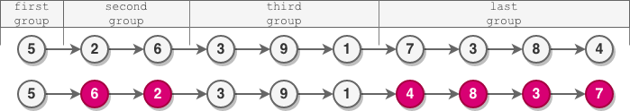

# 反转链表

## 206. Reverse Linked List 反转链表 简单

**206 -> 25 -> 2074**

**基础题 迭代和递归必会**

给你单链表的头节点 head ，请你反转链表，并返回反转后的链表。
 

示例 1：

> 
>
> 输入：head = [1,2,3,4,5]
>
> 输出：[5,4,3,2,1]

示例 2：

> 
>
> 输入：head = [1,2]
> 输出：[2,1]

示例 3：

> 输入：head = []
>
> 输出：[]
 
提示：

- 链表中节点的数目范围是 [0, 5000]
- -5000 <= Node.val <= 5000

**进阶**：链表可以选用迭代或递归方式完成反转。你能否用两种方法解决这道题？

### **解法 1：迭代**
**时间复杂度**：O(n)  
**空间复杂度**：O(1)  
**核心思想**：使用三个指针（prev, curr, next）逐步反转链表。

```
class Solution {
    public ListNode reverseList(ListNode head) {
        ListNode prev = null;
        ListNode curr = head;
        
        while (curr != null) {
            ListNode next = curr.next; // 保存下一个节点
            curr.next = prev;          // 反转当前节点的指针
            prev = curr;               // prev指针后移
            curr = next;               // curr指针后移
        }
        
        return prev;	// prev最终指向新头节点
    }
}
```

**关键点**：
1. **三指针协同**：`prev` 记录前驱节点，`curr` 处理当前节点，`next` 临时保存后续节点
2. **终止条件**：`curr == null` 时，`prev` 指向新头节点
3. **空间高效**：仅使用常数空间


### **解法 2：递归**
**时间复杂度**：O(n)  
**空间复杂度**：O(n)（递归栈）  
**思路**：递归到链表末端，回溯时逐层反转指针。

```
// labuladong p446
// 不要跳进递归。
class Solution {
    public ListNode reverseList(ListNode head) {
        // 基线条件：空链表或单节点链表
        if (head == null || head.next == null) {
            return head;
        }
        
        ListNode newHead = reverseList(head.next); // 递归反转后续链表
        head.next.next = head; // 反转当前节点与下一节点的指针
        head.next = null;      // 避免循环引用
        
        return newHead; // 始终返回新的头节点
    }
}
```

**关键点**：
1. **递归终止**：链表为空或只剩一个节点时直接返回
2. **回溯反转**：从链表末端向前逐个反转指针
3. **缺点**：链表过长时可能导致栈溢出

---

### **解法 3：头插法（Dummy Node）**
**时间复杂度**：O(n)  
**空间复杂度**：O(1)  
**技巧**：利用虚拟头节点，将原链表节点逐个插入到Dummy节点之后。

```
class Solution {
    public ListNode reverseList(ListNode head) {
        ListNode dummy = new ListNode(-1);
        
        while (head != null) {
            ListNode next = head.next;  // 保存下一个节点
            head.next = dummy.next;     // 当前节点插入dummy之后
            dummy.next = head;          // 更新dummy.next
            head = next;                // 移动原链表指针
        }
        
        return dummy.next;
    }
}
```

**适用场景**：
- 需要保持原链表不被破坏时
- 与其他链表操作结合使用（如部分反转）

## 92. Reverse Linked List II 反转链表 II 中等

给你单链表的头指针 head 和两个整数 left 和 right ，其中 left <= right 。请你反转从位置 left 到位置 right 的链表节点，返回 **反转后的链表** 。
 
示例 1：

> 
>
> 输入：head = [1,2,3,4,5], left = 2, right = 4
>
> 输出：[1,4,3,2,5]

示例 2：

> 输入：head = [5], left = 1, right = 1
>
> 输出：[5]
 

提示：

- 链表中节点数目为 n
- 1 <= n <= 500
- -500 <= Node.val <= 500
- 1 <= left <= right <= n
 
**进阶**： 你可以使用一趟扫描完成反转吗？

### 使用206. 反转链表的解法 

主要是为了使用 206. 反转链表，但是这个并不是最优解
**92. 反转链表 II** 也是 **25. K 个一组翻转链表** 的特例

**方法思路**
我们可以利用206题的反转链表方法来解决92题。具体步骤如下：
1. 找到需要反转的子链表的前驱节点 a 和后继节点 b
2. 把 a 和 b 之间的链表反转

```
class Solution {
    public ListNode reverseBetween(ListNode head, int left, int right) {
        // 创建虚拟头节点处理left=1的情况
        ListNode dummy = new ListNode(0);
        dummy.next = head;

        // 第 1 步：从虚拟头节点走 left - 1 步，来到 left 节点的前一个节点
        ListNode prev = dummy;
        for (int i = 0; i < left - 1; i++) {
            prev = prev.next;
        }

        // 第 2 步：从 prev 再走 right - left + 1 步，来到 right 节点
        ListNode curr = prev;
        for (int i = 0; i < right - left + 1; i++) {
            curr = curr.next;
        }  

        reverse(prev, curr.next);

        return dummy.next;
    }

    /**
     * 翻转从 a (不包含) 到 b (不包含) 之间的链表
     * 返回翻转后子链表的尾节点
     */
    private void reverse(ListNode a, ListNode b) {
        ListNode curr = a.next; // 子链表的头节点
        ListNode prev = a;
        ListNode tail = curr; // 翻转后子链表的尾节点

        while (curr != b) {
            ListNode next = curr.next;
            curr.next = prev;
            prev = curr;
            curr = next;
        }

        a.next = prev; // 将前一个 k 组的末尾连接到翻转后的子链表的头部
        tail.next = b; // 将翻转后的子链表的尾部连接到下一个节点
    }
}
```

**复杂度分析**
- 时间复杂度：O(n)，需要遍历链表两次（找节点和反转）
- 空间复杂度：O(1)，只使用了常数级别的额外空间

**递归写法**

```
class Solution {
    public ListNode reverseBetween(ListNode head, int left, int right) {
        // 创建虚拟头节点处理left=1的情况
        ListNode dummy = new ListNode(0);
        dummy.next = head;

        // 第 1 步：从虚拟头节点走 left - 1 步，来到 left 节点的前一个节点
        ListNode prev = dummy;
        for (int i = 0; i < left - 1; i++) {
            prev = prev.next;
        }

        // 第 2 步：从 prev 再走 right - left + 1 步，来到 right 节点
        ListNode curr = prev;
        for (int i = 0; i < right - left + 1; i++) {
            curr = curr.next;
        }  

        reverse(prev, curr.next);

        return dummy.next;
    }

    /**
     * 翻转从 a (不包含) 到 b (不包含) 之间的链表
     * 返回翻转后子链表的尾节点
     */
    private void reverse(ListNode a, ListNode b) {
        ListNode newHead = reverseList(a.next, b);
        a.next = newHead;
    }

    private ListNode reverseList(ListNode head, ListNode b) {
        // 基线条件：空链表或单节点链表
        if (head.next == b) {
            return head;
        }
        
        ListNode newHead = reverseList(head.next, b); // 递归反转后续链表
        head.next.next = head; // 反转当前节点与下一节点的指针
        head.next = b;      // 避免循环引用
        
        return newHead; // 始终返回新的头节点
    }    
}
```

### 解法2：穿针引线（前插法）(最优解)

**方法优化**，上述方法可以进一步优化，减少遍历次数，下面的方法叫做 **穿针引线（前插法）**
> prev和curr一旦固定之后就不移动了，但是next一直在变动

```
class Solution {
    public ListNode reverseBetween(ListNode head, int left, int right) {
        // 设置 dummy 是这一类问题的一般做法
        ListNode dummy = new ListNode(-1);
        dummy.next = head;
        ListNode prev = dummy;

        for (int i = 0; i < left - 1; i++) {
            prev = prev.next;
        }

        ListNode curr = prev.next;
        // 注意 i 的上限，画图就知道了
        for (int i = 0; i < right - left; i++) {
            ListNode next = curr.next;
            curr.next = next.next;
            next.next = prev.next;
            prev.next = next;
        }
        
        return dummy.next;
    }
}
```
**复杂度分析**
- 时间复杂度：O(N)，其中 N 是链表总节点数。最多只遍历了链表一次，就完成了反转。
- 空间复杂度：O(1)。只使用到常数个变量。

### 解法3：递归法
**思路：**
最终落到反转前 n 个节点，这个时候要有后继节点，和206的递归对照着看，几乎一样。

```
// labuladong p448
class Solution {
    // 后驱节点
    ListNode successor = null;

    // 反转以head为起点的n个节点，返回新的头结点
    ListNode reverseN(ListNode head, int n) {
        if (n == 1) {
            // 记录第n+1个节点
            successor = head.next;
            return head;
        }

        // 以head.next为起点，需要反转前n-1个节点
        ListNode last = reverseN(head.next, n - 1);
        head.next.next = head;
        // 让反转之后的head节点和后面的节点连起来
        head.next = successor;
        return last;
    }

    public ListNode reverseBetween(ListNode head, int left, int right) {
        // base case
        if (left == 1) {
            return reverseN(head, right);
        }

        // 前进到反转的起点触发 base case 注意：如果left - 1，那么right也需要减1，因为它是表示一个范围	
        head.next = reverseBetween(head.next, left - 1, right - 1);
        return head;
    }
}
```
**复杂度分析**
- 时间复杂度：O(n)​​。
- 空间复杂度：O(n)​​（递归栈空间）。

​​适用场景​​：递归思路清晰，但空间复杂度较高。

## 25. Reverse Nodes in k-Group K 个一组翻转链表 困难

给你链表的头节点 head ，每 k 个节点一组进行翻转，请你返回修改后的链表。

k 是一个正整数，它的值小于或等于链表的长度。如果节点总数不是 k 的整数倍，那么请将最后剩余的节点保持原有顺序。

你不能只是单纯的改变节点内部的值，而是需要实际进行节点交换。

示例 1：

> 
>
> 输入：head = [1,2,3,4,5], k = 2
>
> 输出：[2,1,4,3,5]

示例 2：

> 
>
> 输入：head = [1,2,3,4,5], k = 3
>
> 输出：[3,2,1,4,5]
 
提示：

- 链表中的节点数目为 n
- 1 <= k <= n <= 5000
- 0 <= Node.val <= 1000
 
**进阶**：你可以设计一个只用 O(1) 额外内存空间的算法解决此问题吗？


✅ 解法一：遍历 + 模拟（迭代方式）

**思路如下：**

1. 使用虚拟头节点方便连接。
2. 遍历链表，每次尝试从当前位置取出 k 个节点。
3. 若节点数不足 k，则不反转。
4. 若足够 k 个节点，使用局部反转函数处理这一段，并接回链表。

```
/**
class Solution {
    public ListNode reverseKGroup(ListNode head, int k) {
        // 虚拟头节点
        ListNode dummy = new ListNode(-1, head);
        ListNode prevGroupTail = dummy;

        while (head != null) {
             // 找到这一组的尾节点
            ListNode kth = getKthNode(head, k);
            // 不足k个，退出 
            if (kth == null) {
                break;   
            }

            // 保存下一组的起点
            ListNode nextGroupHead = kth.next; 
            // 反转这一组
            ListNode[] reversed = reverse(head, k);
            ListNode newGroupHead = reversed[0];
            ListNode newGroupTail = reversed[1];

            // 接回原链表
            prevGroupTail.next = newGroupHead;
            newGroupTail.next = nextGroupHead;

            // 移动到下一组
            prevGroupTail = newGroupTail;
            head = nextGroupHead;
        }
        return dummy.next;
    }

    // 获取当前组的第k个节点
    private ListNode getKthNode(ListNode head, int k) {
        while (head != null && k > 1) {
            head = head.next;
            k--;
        }
        return head;
    }    

    // 反转count个节点，返回新头和新尾
    private ListNode[] reverse(ListNode head, int k) {
        ListNode prev = null;
        ListNode curr = head;
        while (k-- > 0) {
            ListNode next = curr.next;
            curr.next = prev;
            prev = curr;
            curr = next;
        }
        return new ListNode[]{prev, head}; // 返回新的头和尾
    }
}
```

- 时间复杂度：每个节点最多访问两次，O(n)
- 空间复杂度：使用常数指针，O(1)

**这个解法和 2074 的模拟逻辑一脉相承：**

- 分组处理节点
- 判断是否需要操作（2074 判断是否偶数，25 始终反转满组）
- 局部反转并接回链表


还是使用了 206. Reverse Linked List 反转链表，只不过是反转 a b 节点中间的链表。

```
class Solution {
    public ListNode reverseKGroup(ListNode head, int k) {
        if (head == null || k <= 1) {
            return head;
        }

        ListNode dummy = new ListNode(0); // 创建一个虚拟头节点，方便操作
        dummy.next = head;
        ListNode prev = dummy; // 指向前一个 k 组的末尾
        ListNode curr = head; // 指向当前 k 组的起始节点
        int count = 0;
        while (curr != null) {
            count++;
            if (count % k == 0) { // 当遍历到第 k 个节点时，进行翻转
                prev = reverse(prev, curr.next); // 翻转从 prev.next 到 curr 的 k 个节点
                curr = prev.next; // 更新 curr 指向下一个 k 组的起始节点
            } else {
                curr = curr.next;
            }
        }

        return dummy.next;
    }

    /**
     * 翻转从 a (不包含) 到 b (不包含) 之间的链表
     * 返回翻转后子链表的尾节点
     */
    private ListNode reverse(ListNode a, ListNode b) {
        ListNode curr = a.next; // 子链表的头节点
        ListNode prev = a;
        ListNode tail = curr; // 翻转后子链表的尾节点

        while (curr != b) {
            ListNode next = curr.next;
            curr.next = prev;
            prev = curr;
            curr = next;
        }

        a.next = prev; // 将前一个 k 组的末尾连接到翻转后的子链表的头部
        tail.next = b; // 将翻转后的子链表的尾部连接到下一个节点

        return tail; // 返回翻转后子链表的尾节点，也就是下一个 k 组的 prev
    }
}
```

**复杂度分析**
- 时间复杂度：O(n)，其中 n 是链表的长度。每个节点最多被访问和操作一次。
- 空间复杂度：O(1)。

## 24. Swap Nodes in Pairs 两两交换链表中的节点 中等

给你一个链表，两两交换其中相邻的节点，并返回交换后链表的头节点。你必须在不修改节点内部的值的情况下完成本题（即，只能进行节点交换）。

示例 1：

> 
>
> 输入：head = [1,2,3,4]
>
> 输出：[2,1,4,3]

示例 2：

> 输入：head = []
>
> 输出：[]

示例 3：

> 输入：head = [1]
>
> 输出：[1]
 
提示：

- 链表中节点的数目在范围 [0, 100] 内
- 0 <= Node.val <= 100

### 迭代法（最优解）

- 时间复杂度：O(n)​​
- 空间复杂度：O(1)​​
​​
```
public class Solution {
    public ListNode swapPairs(ListNode head) {
        ListNode dummy = new ListNode(0); // 虚拟头节点
        dummy.next = head;
        ListNode prev = dummy; // 前驱节点

        while (prev.next != null && prev.next.next != null) {
            ListNode first = prev.next; // 第一个节点
            ListNode second = prev.next.next; // 第二个节点

            // 交换节点
            first.next = second.next;
            second.next = first;
            prev.next = second;

            // 移动前驱节点
            prev = first;
        }

        return dummy.next;
    }
}
```

### 递归法

- 时间复杂度：O(n)​​
- 空间复杂度：O(n)​​（递归栈空间）

```
class Solution {
    public ListNode swapPairs(ListNode head) {
        // 递归终止条件：空链表或只有一个节点
        if (head == null || head.next == null) {
            return head;
        }
        
        ListNode first = head;       // 第一个节点
        ListNode second = head.next; // 第二个节点
        
        // 递归交换后续节点
        first.next = swapPairs(second.next);
        second.next = first; // 交换当前两个节点
        
        return second; // 返回新的头节点
    }
}
```

## 2074. Reverse Nodes in Even Length Groups 反转偶数长度组的节点 中等

给你一个链表的头节点 head 。

链表中的节点 **按顺序** 划分成若干 **非空** 组，这些非空组的长度构成一个自然数序列（1, 2, 3, 4, ...）。一个组的 **长度** 就是组中分配到的节点数目。换句话说：

- 节点 1 分配给第一组
- 节点 2 和 3 分配给第二组
- 节点 4、5 和 6 分配给第三组，以此类推

注意，最后一组的长度可能小于或者等于 1 + 倒数第二组的长度 。

**反转** 每个 **偶数** 长度组中的节点，并返回修改后链表的头节点 head 。
 
示例 1：

> 
>
> 输入：head = [5,2,6,3,9,1,7,3,8,4]
>
> 输出：[5,6,2,3,9,1,4,8,3,7]
>
> 解释：
>
> - 第一组长度为 1 ，奇数，没有发生反转。
>
> - 第二组长度为 2 ，偶数，节点反转。
>
> - 第三组长度为 3 ，奇数，没有发生反转。
>
> - 最后一组长度为 4 ，偶数，节点反转。

示例 2：

> 
>
> 输入：head = [1,1,0,6]
>
> 输出：[1,0,1,6]
>
> 解释：
>
> - 第一组长度为 1 ，没有发生反转。
> - 第二组长度为 2 ，节点反转。
> - 最后一组长度为 1 ，没有发生反转。

示例 3：

> 输入：head = [2,1]
>
> 输出：[2,1]
> 
> 解释：
> 
> - 第一组长度为 1 ，没有发生反转。
> - 最后一组长度为 1 ，没有发生反转。
 

提示：

- 链表中节点数目范围是 [1, 105]
- 0 <= Node.val <= 105

解法一：遍历 + 模拟（最优解 ✅）

```
// 最优解 ✅
class Solution {
    public ListNode reverseEvenLengthGroups(ListNode head) {
        ListNode dummy = new ListNode(0, head);
        ListNode prev = dummy;
        int groupSize = 1;

        while (head != null) {
            // 找到当前组的尾部，统计当前组节点数
            ListNode tail = head;
            int count = 0;
            for (int i = 0; i < groupSize && tail != null; i++) {
                tail = tail.next;
                count++;
            }

            // 反转偶数长度组
            if (count % 2 == 0) {
                // 反转从head开始count个节点
                ListNode[] reversed = reverse(head, count);
                prev.next = reversed[0];
                reversed[1].next = tail;
                prev = reversed[1];
                head = tail;
            } else {
                for (int i = 0; i < count; i++) {
                    prev = head;
                    head = head.next;
                }
            }

            groupSize++;
        }

        return dummy.next;
    }

    // 反转count个节点，返回新头和新尾
    private ListNode[] reverse(ListNode head, int count) {
        ListNode prev = null;
        ListNode curr = head;
        while (count-- > 0) {
            ListNode next = curr.next;
            curr.next = prev;
            prev = curr;
            curr = next;
        }
        return new ListNode[]{prev, head}; // 返回新的头和尾
    }
}
```

- 时间复杂度：每个节点只被访问一次，O(n)
- 空间复杂度：仅使用常数变量，O(1)
