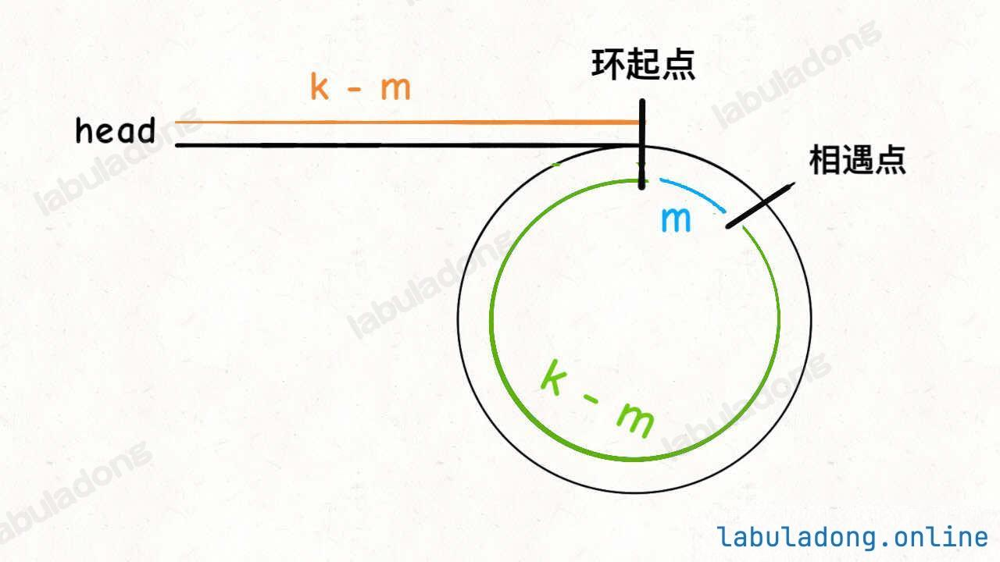

- [876. Middle of the Linked List 链表的中间结点 简单](#876-middle-of-the-linked-list-链表的中间结点-简单)
- [2095. Delete the Middle Node of a Linked List 删除链表的中间节点 中等](#2095-delete-the-middle-node-of-a-linked-list-删除链表的中间节点-中等)
- [19. Remove Nth Node From End of List 删除链表的倒数第 N 个结点 中等](#19-remove-nth-node-from-end-of-list-删除链表的倒数第-n-个结点-中等)
- [面试题 02.02. Kth Node From End of List 返回倒数第 k 个节点](#面试题-0202-kth-node-from-end-of-list-返回倒数第-k-个节点)
- [143. Reorder List 重排链表 中等](#143-reorder-list-重排链表-中等)
- [234. Palindrome Linked List 回文链表 简单](#234-palindrome-linked-list-回文链表-简单)
- [21. Merge Two Sorted Lists 合并两个有序链表 简单](#21-merge-two-sorted-lists-合并两个有序链表-简单)
- [23. Merge k Sorted Lists 合并 K 个升序链表 困难](#23-merge-k-sorted-lists-合并-k-个升序链表-困难)
- [148. Sort List 排序链表 中等](#148-sort-list-排序链表-中等)
- [141. Linked List Cycle 环形链表 简单](#141-linked-list-cycle-环形链表-简单)
- [142. Linked List Cycle II 环形链表 II 中等](#142-linked-list-cycle-ii-环形链表-ii-中等)
- [1721. Swapping Nodes in a Linked List 交换链表中的节点 中等](#1721-swapping-nodes-in-a-linked-list-交换链表中的节点-中等)
- [160. Intersection of Two Linked Lists 相交链表 简单](#160-intersection-of-two-linked-lists-相交链表-简单)
- [1650. Lowest Common Ancestor of a Binary Tree III 二叉树的最近公共祖先 III 中等](#1650-lowest-common-ancestor-of-a-binary-tree-iii-二叉树的最近公共祖先-iii-中等)

## 876. Middle of the Linked List 链表的中间结点 简单

给你单链表的头结点 head ，请你找出并返回链表的中间结点。

如果有两个中间结点，则返回第二个中间结点。


示例 1：

> 
>
> 输入：head = [1,2,3,4,5]
> 
> 输出：[3,4,5]
>
> 解释：链表只有一个中间结点，值为 3 。

示例 2：

> 
>
> 输入：head = [1,2,3,4,5,6]
>
> 输出：[4,5,6]
>
> 解释：该链表有两个中间结点，值分别为 3 和 4 ，返回第二个结点。

提示：

- 链表的结点数范围是 [1, 100]
- 1 <= Node.val <= 100

```
class Solution {
    public ListNode middleNode(ListNode head) {
        // 快指针每次走两步，慢指针每次走一步
        ListNode slow = head, fast = head;
        while (fast != null && fast.next != null) {
            slow = slow.next;         // 慢指针走一步
            fast = fast.next.next;    // 快指针走两步
        }
        // 当快指针到达末尾时，慢指针正好在中间
        return slow;
    }
}
```

- 时间复杂度：O(n)
- 空间复杂度：O(1)

**说明：** 一次遍历，双指针无额外空间，是最优解。

## 2095. Delete the Middle Node of a Linked List 删除链表的中间节点 中等

给你一个链表的头节点 head 。删除 链表的 中间节点 ，并返回修改后的链表的头节点 head 。

长度为 n 链表的中间节点是从头数起第 ⌊n / 2⌋ 个节点（下标从 0 开始），其中 ⌊x⌋ 表示小于或等于 x 的最大整数。

对于 n = 1、2、3、4 和 5 的情况，中间节点的下标分别是 0、1、1、2 和 2 。
 
示例 1：

> 
>
> 输入：head = [1,3,4,7,1,2,6]
> 
> 输出：[1,3,4,1,2,6]
>
> 解释：
> 
> 上图表示给出的链表。节点的下标分别标注在每个节点的下方。
>
> 由于 n = 7 ，值为 7 的节点 3 是中间节点，用红色标注。
>
> 返回结果为移除节点后的新链表。 

示例 2：

> 
>
> 输入：head = [1,2,3,4]
>
> 输出：[1,2,4]
>
> 解释：

> 上图表示给出的链表。

> 对于 n = 4 ，值为 3 的节点 2 是中间节点，用红色标注。

示例 3：

> 
>
> 输入：head = [2,1]
>
> 输出：[2]
>
> 解释：
>
> 上图表示给出的链表。
>
> 对于 n = 2 ，值为 1 的节点 1 是中间节点，用红色标注。
>
> 值为 2 的节点 0 是移除节点 1 后剩下的唯一一个节点。
 
提示：

- 链表中节点的数目在范围 [1, 105] 内
- 1 <= Node.val <= 105

```
// 使用 dummy 结点的解法（快慢指针 + 前驱节点记录 + dummy头）
class Solution {
    public ListNode deleteMiddle(ListNode head) {
        // 虚拟头结点，简化删除逻辑
        ListNode dummy = new ListNode(-1, head);
        ListNode slow = head;
        ListNode fast = head;
        ListNode prev = dummy;
        
        // 快慢指针：fast 每次走两步，slow 每次走一步
        while (fast != null && fast.next != null) {
            prev = slow;
            slow = slow.next;
            fast = fast.next.next;
        }

        // 删除中间节点：prev 是 slow 的前一个节点
        prev.next = slow.next;
        return dummy.next;
    }
}
```

- 时间复杂度：O(n)，单次遍历
- 空间复杂度：O(1)，仅使用常数指针

## 19. Remove Nth Node From End of List 删除链表的倒数第 N 个结点 中等

给你一个链表，删除链表的倒数第 n 个结点，并且返回链表的头结点。

示例 1：

> 
>
> 输入：head = [1,2,3,4,5], n = 2
>
> 输出：[1,2,3,5]

示例 2：

> 输入：head = [1], n = 1
>
> 输出：[]

示例 3：

> 输入：head = [1,2], n = 1
>
> 输出：[1]
 

提示：

- 链表中结点的数目为 sz
- 1 <= sz <= 30
- 0 <= Node.val <= 100
- 1 <= n <= sz
 
进阶：你能尝试使用一趟扫描实现吗？

```
class Solution {
    public ListNode removeNthFromEnd(ListNode head, int n) {
        // 创建一个虚拟头节点，方便处理删除头节点的情况
        ListNode dummy = new ListNode(0);
        dummy.next = head;

        // 初始化快慢指针
        ListNode fast = dummy;
        ListNode slow = dummy;

        // 快指针先向前移动 n 步
        for (int i = 0; i < n; i++) {
            fast = fast.next;
        }

        // 同时移动快慢指针，直到快指针到达链表末尾
        while (fast != null && fast.next != null) {
            fast = fast.next;
            slow = slow.next;
        }

        // 此时 slow 指向倒数第 n 个节点的前一个节点
        // 将 slow 的 next 指向下下个节点，从而删除倒数第 n 个节点
        slow.next = slow.next.next;

        return dummy.next;
    }
}
```

- 时间复杂度：O(n) 一次遍历链表，n 为链表长度。
- 空间复杂度：O(1) 使用常数指针。

**说明：** 推荐写法，健壮、高效，处理所有边界问题。


## 面试题 02.02. Kth Node From End of List 返回倒数第 k 个节点 

实现一种算法，找出单向链表中倒数第 k 个节点。返回该节点的值。

**注意：** 本题相对原题稍作改动

示例：

> 输入： 1->2->3->4->5 和 k = 2
>
> 输出： 4

**说明：**

给定的 k 保证是有效的。

快慢指针法（最优解）

```
// 最优解：一次遍历，快慢指针
class Solution {
    public ListNode kthToLast(ListNode head, int k) {
        ListNode fast = head;
        ListNode slow = head;

        // 快指针先走 k 步
        for (int i = 0; i < k; i++) {
            fast = fast.next;
        }

        // 快慢指针同时走，直到 fast 到尾部
        while (fast != null) {
            fast = fast.next;
            slow = slow.next;
        }

        // 此时 slow 就是倒数第 k 个节点
        return slow;
    }
}
```
- 时间复杂度：O(n) 一次遍历链表即可，n 是链表长度。
- 空间复杂度：O(1) 只使用常数级别的指针。

**说明：** 这是最推荐、最高效的方法，时间空间最优，逻辑清晰。


## 143. Reorder List 重排链表 中等

给定一个单链表 L 的头节点 head ，单链表 L 表示为：

> L0 → L1 → … → Ln - 1 → Ln

请将其重新排列后变为：

> L0 → Ln → L1 → Ln - 1 → L2 → Ln - 2 → …

不能只是单纯的改变节点内部的值，而是需要实际的进行节点交换。

示例 1：

> 
>
> 输入：head = [1,2,3,4]
>
> 输出：[1,4,2,3]

示例 2：

> 
>
> 输入：head = [1,2,3,4,5]
>
> 输出：[1,5,2,4,3]
 
提示：

- 链表的长度范围为 [1, 5 * 10<sup>4</sup>]
- 1 <= node.val <= 1000

**快慢指针 + 链表反转 + 合并（最优解 ✅）**

**思路分 3 步：**

1. 使用快慢指针找中点
2. 反转后半部分链表
3. 合并前半和后半链表

```
class Solution {
    public void reorderList(ListNode head) {
        if (head == null || head.next == null) {
            return;
        }

        // 1. 快慢指针找中点
        ListNode fast = head, slow = head;
        while (fast != null && fast.next != null) {
            slow = slow.next;
            fast = fast.next.next;
        }

        // 2. 反转后半部分链表
        ListNode secondHalf = reverseList(slow.next);
        // 截断前后两部分
        slow.next = null;

        // 3. 合并两部分
        mergeLists(head, secondHalf);
    }

    private ListNode reverseList(ListNode head) {
        ListNode prev = null;
        ListNode curr = head;
        while (curr != null) {
            ListNode next = curr.next;
            curr.next = prev;
            prev = curr;
            curr = next;
        }
        return prev;
    }

    private void mergeLists(ListNode first, ListNode second) {
        while (second != null) {
            ListNode firstNext = first.next;
            ListNode secondNext = second.next;

            first.next = second;
            second.next = firstNext;

            first = firstNext;
            second = secondNext;
        }
    }
}
```

- 时间复杂度：O(n) 找中点、反转链表、合并链表各需 O(n)
- 空间复杂度：O(1) 原地操作，仅用少量指针变量

**说明：** 这是最优解，空间效率最高，思路清晰，面试首选！


## 234. Palindrome Linked List 回文链表 简单

给你一个单链表的头节点 head ，请你判断该链表是否为回文链表。如果是，返回 true ；否则，返回 false 。

示例 1：

> 
>
> 输入：head = [1,2,2,1]
> 
> 输出：true

示例 2：

> 
>
> 输入：head = [1,2]
>
> 输出：false

提示：

- 链表中节点数目在范围[1, 10<sup>5</sup>] 内
- 0 <= Node.val <= 9
 
**进阶：** 你能否用 O(n) 时间复杂度和 O(1) 空间复杂度解决此题？

**快慢指针 + 反转链表 + 对比（最优解 ✅）**

**思路：**

1. 快慢指针找中点
2. 反转后半段链表
3. 比较前后两段是否一致

```
class Solution {
    public boolean isPalindrome(ListNode head) {
        if (head == null || head.next == null) {
            return true;
        }

        // 1. 快慢指针找中点
        ListNode slow = head, fast = head;
        while (fast != null && fast.next != null) {
            slow = slow.next;
            fast = fast.next.next;
        }        

        // 2. 反转后半部分, 与 143. Reorder List 根据实际情况让前一部分或者后一部分多
        ListNode secondHalf = reverseList(slow);

        // 3. 比较前后两段
        ListNode p1 = head;
        ListNode p2 = secondHalf;
        while (p2 != null) {
            if (p1.val != p2.val) {
                return false;
            }
            p1 = p1.next;
            p2 = p2.next;
        }
        return true;
    }

    // 反转链表
    private ListNode reverseList(ListNode head) {
        ListNode prev = null;
        ListNode curr = head;
        while (curr != null) {
            ListNode next = curr.next;
            curr.next = prev;
            prev = curr;
            curr = next;
        }
        return prev;
    }    
}
```

- 时间复杂度：O(n)
- 空间复杂度：O(1)

原地操作，性能最优，是实际面试最推荐写法。


## 21. Merge Two Sorted Lists 合并两个有序链表 简单

将两个升序链表合并为一个新的 **升序** 链表并返回。新链表是通过拼接给定的两个链表的所有节点组成的。 

示例 1：

> 
>
> 输入：l1 = [1,2,4], l2 = [1,3,4]
>
> 输出：[1,1,2,3,4,4]

示例 2：

> 输入：l1 = [], l2 = []
>
> 输出：[]

示例 3：

> 输入：l1 = [], l2 = [0]
>
> 输出：[0]
 
提示：

- 两个链表的节点数目范围是 [0, 50]
- -100 <= Node.val <= 100
- l1 和 l2 均按 **非递减顺序** 排列

**解法一：迭代合并（最优解 ✅）**

```
// ✅ 最优解：原地合并，时间 O(n)，空间 O(1)
class Solution {
    public ListNode mergeTwoLists(ListNode list1, ListNode list2) {
        // 虚拟头结点，方便统一操作
        ListNode dummy = new ListNode(-1);
        ListNode curr = dummy;

        // 遍历两个链表，比较大小依次添加
        while (list1 != null && list2 != null) {
            if (list1.val <= list2.val) {
                curr.next = list1;
                list1 = list1.next;
            } else {
                curr.next = list2;
                list2 = list2.next;
            }
            curr = curr.next;
        }

        // 剩下的直接接上
        curr.next = (list1 != null) ? list1 : list2;

        return dummy.next;
    }
}
```

- 时间复杂度：O(n + m) n、m 分别是两个链表长度
- 空间复杂度：O(1) 原地操作，只用常数指针

说明：这是最推荐解法，空间效率最高

**解法二：递归合并**

```
class Solution {
    public ListNode mergeTwoLists(ListNode list1, ListNode list2) {
        // 任一为空直接返回另一个
        if (list1 == null) return list2;
        if (list2 == null) return list1;

        if (list1.val <= list2.val) {
            list1.next = mergeTwoLists(list1.next, list2);
            return list1;
        } else {
            list2.next = mergeTwoLists(list1, list2.next);
            return list2;
        }
    }
}
```

- 时间复杂度：O(n + m)
- 空间复杂度：O(n + m)（递归栈）

⚠️ 简洁但递归层数可能较深，不适用于大数据量链表（容易栈溢出）


## 23. Merge k Sorted Lists 合并 K 个升序链表 困难

给你一个链表数组，每个链表都已经按升序排列。

请你将所有链表合并到一个升序链表中，返回合并后的链表。

 
示例 1：

> 输入：lists = [[1,4,5],[1,3,4],[2,6]]
>
> 输出：[1,1,2,3,4,4,5,6]
>
> 解释：链表数组如下：
>
> [
>
>   1->4->5,
>
>   1->3->4,
>
>   2->6
>
> ]
>
> 将它们合并到一个有序链表中得到。
>
> 1->1->2->3->4->4->5->6

示例 2：

> 输入：lists = []
>
> 输出：[]

示例 3：

> 输入：lists = [[]]
>
> 输出：[]
 
提示：

- k == lists.length
- 0 <= k <= 10^4
- 0 <= lists[i].length <= 500
- -10^4 <= lists[i][j] <= 10^4
- lists[i] 按 **升序** 排列
- lists[i].length 的总和不超过 10^4


**解法一：优先队列（小顶堆）合并（最优解 ✅）**

**核心思想：** 利用最小堆，每次取出最小节点，接入新链表。


```
class Solution {
    public ListNode mergeKLists(ListNode[] lists) {
        if (lists == null || lists.length == 0) {
            return null;
        }   

        // 小顶堆，按节点值升序排列
        PriorityQueue<ListNode> heap = new PriorityQueue<>((a, b) -> a.val - b.val);

        // 初始化：将每个链表的头结点加入堆中
        for (ListNode list : lists) {
            if (list != null) {
                heap.offer(list);
            }
        }

        ListNode dummy = new ListNode(-1);
        ListNode curr = dummy;

        // 每次取最小值节点
        while (!heap.isEmpty()) {
            ListNode node = heap.poll();
            curr.next = node;
            curr = curr.next;
            
            if (node.next != null) {
                heap.offer(node.next);
            }
        }

        return dummy.next;
    }
}
```

- 时间复杂度：O(N log k) N 是所有节点总数，k 是链表数量 每个节点最多入堆/出堆一次，堆操作为 log k
- 空间复杂度：O(k) 堆最大存储 k 个节点

说明：最优解，适用于 k 很大时，性能稳定，面试首选。

**解法二：分治合并（递归合并两两链表）**

```
class Solution {
    public ListNode mergeKLists(ListNode[] lists) {
        if (lists == null || lists.length == 0) {
            return null;
        }     

        return mergeKLists(lists, 0, lists.length - 1);
    }

    private ListNode mergeKLists(ListNode[] lists, int l, int r) {
        if (l == r) {
            return lists[l];
        }

        int mid = l + (r - l) / 2;
        return mergeTwoLists(mergeKLists(lists, l, mid), mergeKLists(lists, mid + 1, r));
    }

    private ListNode mergeTwoLists(ListNode list1, ListNode list2) {
        // 虚拟头结点，方便统一操作
        ListNode dummy = new ListNode(-1);
        ListNode curr = dummy;

        // 遍历两个链表，比较大小依次添加
        while (list1 != null && list2 != null) {
            if (list1.val <= list2.val) {
                curr.next = list1;
                list1 = list1.next;
            } else {
                curr.next = list2;
                list2 = list2.next;
            }
            curr = curr.next;
        }

        // 剩下的直接接上
        curr.next = (list1 != null) ? list1 : list2;

        return dummy.next;
    }
}
```

N 是所有节点总数，k 是链表数量
- 时间复杂度：O(N log k) 每轮合并两两链表，log k 层，每层最多 O(N) 总合并量
- 空间复杂度：O(log k) 递归栈深度 log k

说明：性能与堆解法相当，代码结构清晰，适合面试手写。

## 148. Sort List 排序链表 中等

给你链表的头结点 head ，请将其按 **升序** 排列并返回 **排序后的链表** 。

示例 1：

> 
>
> 输入：head = [4,2,1,3]
> 
> 输出：[1,2,3,4]

示例 2：

> 
>
> 输入：head = [-1,5,3,4,0]
> 
> 输出：[-1,0,3,4,5]

示例 3：

> 输入：head = []
> 
> 输出：[]
 
提示：

- 链表中节点的数目在范围 [0, 5 * 10<sup>4</sup>] 内
- -10<sup>5</sup> <= Node.val <= 10<sup>5</sup>
 
**进阶**：你可以在 O(n log n) 时间复杂度和常数级空间复杂度下，对链表进行排序吗？

- 时间复杂度：O(n log n)  
- 空间复杂度：O(log n)（递归栈）  

核心思想：分治法，递归地将链表拆分为两半，分别排序后合并。

```
class Solution {
    public ListNode sortList(ListNode head) {
        if (head == null || head.next == null) {
            return head;
        }

        // 断开链表并递归排序
        ListNode mid = findMid(head);
        ListNode right = sortList(mid.next);
        mid.next = null;
        ListNode left = sortList(head);
        return mergeTwoLists(left, right);
    }

    // 找到链表中点
    private ListNode findMid(ListNode head) {
        ListNode slow = head, fast = head.next;
        while (fast != null && fast.next != null) {
            slow = slow.next;
            fast = fast.next.next;
        }
        return slow;
    }    

    // 合并两个有序链表
    private ListNode mergeTwoLists(ListNode l1, ListNode l2) {
        ListNode dummy = new ListNode(0);
        ListNode current = dummy;
        while (l1 != null && l2 != null) {
            if (l1.val < l2.val) {
                current.next = l1;
                l1 = l1.next;
            } else {
                current.next = l2;
                l2 = l2.next;
            }
            current = current.next;
        }
        if (l1 != null) {
            current.next = l1;
        }
        if (l2 != null) {
            current.next = l2;
        }
        return dummy.next;
    }    
}
```

## 141. Linked List Cycle 环形链表 简单 

给你一个链表的头节点 head ，判断链表中是否有环。

如果链表中有某个节点，可以通过连续跟踪 next 指针再次到达，则链表中存在环。 为了表示给定链表中的环，评测系统内部使用整数 pos 来表示链表尾连接到链表中的位置（索引从 0 开始）。 **注意：pos 不作为参数进行传递** 。仅仅是为了标识链表的实际情况。

如果链表中存在环 ，则返回 true 。 否则，返回 false 。

示例 1：

> 
>
> 输入：head = [3,2,0,-4], pos = 1
>
> 输出：true
>
> 解释：链表中有一个环，其尾部连接到第二个节点。

示例 2：

> 
>
> 输入：head = [1,2], pos = 0
>
> 输出：true
>
> 解释：链表中有一个环，其尾部连接到第一个节点。

示例 3：

> 
>
> 输入：head = [1], pos = -1
>
> 输出：false
>
> 解释：链表中没有环。
 
提示：

- 链表中节点的数目范围是 [0, 10<sup>4</sup>]
- -10<sup>5</sup> <= Node.val <= 10<sup>5</sup>
- pos 为 -1 或者链表中的一个 **有效索引** 。
 
**进阶**：你能用 O(1)（即，常量）内存解决此问题吗？


** 快慢指针 labuladong p112**

```
Time: O(n)  Space: O(1)
public class Solution {
    public boolean hasCycle(ListNode head) {
        // 快慢指针初始化指向head
        ListNode slow = head, fast = head;
        // 快指针走到末尾时停止
        while (fast != null && fast.next != null) {
            // 慢指针走一步，快指针走两步
            slow = slow.next;
            fast = fast.next.next;
            // 快慢指针相遇，说明含有环
            if (slow == fast) {
                return true;
            }
        }
        // 不包含环
        return false;
    }
}
```

- 时间复杂度：O(n) 最多访问每个节点两次
- 空间复杂度：O(1) 常数指针

说明：效率最高，空间最优，是绝大多数面试官期待的答案。


## 142. Linked List Cycle II 环形链表 II 中等

给定一个链表的头节点  head ，返回链表开始入环的第一个节点。 如果链表无环，则返回 null。

如果链表中有某个节点，可以通过连续跟踪 next 指针再次到达，则链表中存在环。 为了表示给定链表中的环，评测系统内部使用整数 pos 来表示链表尾连接到链表中的位置（**索引从 0 开始**）。如果 pos 是 -1，则在该链表中没有环。**注意：pos 不作为参数进行传递**，仅仅是为了标识链表的实际情况。

**不允许修改** 链表。

示例 1：

> 
>
> 输入：head = [3,2,0,-4], pos = 1
>
> 输出：返回索引为 1 的链表节点
>
> 解释：链表中有一个环，其尾部连接到第二个节点。

示例 2：

> 
>
> 输入：head = [1,2], pos = 0
>
> 输出：返回索引为 0 的链表节点
>
> 解释：链表中有一个环，其尾部连接到第一个节点。

示例 3：

> 
>
> 输入：head = [1], pos = -1
>
> 输出：返回 null
>
> 解释：链表中没有环。
 
提示：

- 链表中节点的数目范围在范围 [0, 10<sup>4</sup>] 内
- -10<sup>5</sup> <= Node.val <= 10<sup>5</sup>
- pos 的值为 -1 或者链表中的一个有效索引

**进阶：** 你是否可以使用 O(1) 空间解决此题？

```
public class Solution {
    public ListNode detectCycle(ListNode head) {
        ListNode fast = head, slow = head;
		
		// 针对奇数个或者偶数个节点
        while (fast != null && fast.next != null) {
            slow = slow.next;
            fast = fast.next.next;
            if (fast == slow) {
                break;
            }
        }  

        // 上面的代码类似hasCycle函数
        if (fast == null || fast.next == null) {
            // fast遇到空指针说明没有环
            return null;
        }   

        // 重新指向头结点
        slow = head;
        // 快慢指针同步前进，相交点就是环起点
        while (slow != fast) {
            fast = fast.next;
            slow = slow.next;
        }

        return slow;
    }
}
```

- 时间复杂度：O(n) 遍历一次找相遇点 + 一次找入口点
- 空间复杂度：O(1) 使用常数级别指针，无额外数据结构

说明：这是面试标准解法，结合数学理解，性能最优

**原理**

我们假设快慢指针相遇时，慢指针 slow 走了 k 步，那么快指针 fast 一定走了 2k 步：


fast 一定比 slow 多走了 k 步，这多走的 k 步其实就是 fast 指针在环里转圈圈，所以 k 的值就是环长度的「整数倍」。

假设相遇点距环的起点的距离为 m，那么结合上图的 slow 指针，环的起点距头结点 head 的距离为 k - m，也就是说如果从 head 前进 k - m 步就能到达环起点。

巧的是，如果从相遇点继续前进 k - m 步，也恰好到达环起点。因为结合上图的 fast 指针，从相遇点开始走k步可以转回到相遇点，那走 k - m 步肯定就走到环起点了：



所以，只要我们把快慢指针中的任一个重新指向 head，然后两个指针同速前进，k - m 步后一定会相遇，相遇之处就是环的起点了。


## 1721. Swapping Nodes in a Linked List 交换链表中的节点 中等

给你链表的头节点 head 和一个整数 k 。

**交换** 链表正数第 k 个节点和倒数第 k 个节点的值后，返回链表的头节点（链表 **从 1 开始索引**）。

示例 1：

> 
>
> 输入：head = [1,2,3,4,5], k = 2
>
> 输出：[1,4,3,2,5]

示例 2：

> 输入：head = [7,9,6,6,7,8,3,0,9,5], k = 5
>
> 输出：[7,9,6,6,8,7,3,0,9,5]

示例 3：

> 输入：head = [1], k = 1
>
> 输出：[1]

示例 4：

> 输入：head = [1,2], k = 1
> 
> 输出：[2,1]

示例 5：

> 输入：head = [1,2,3], k = 2
>
> 输出：[1,2,3]
 
提示：

- 链表中节点的数目是 n
- 1 <= k <= n <= 105
- 0 <= Node.val <= 100


**双指针解法（最优解）**

**复杂度分析**
- 时间复杂度：O(n)
- 空间复杂度：O(1)
最优解原因：只需一次遍历即可定位和交换节点，空间效率最高。

```
class Solution {
    public ListNode swapNodes(ListNode head, int k) {
        ListNode dummy = new ListNode(0);
        dummy.next = head;

        // 初始化指针
        ListNode fast = dummy, slow = dummy;
        ListNode firstPrev = null, secondPrev = null;

        // 找到第k个节点及其前驱
        for (int i = 0; i < k; i++) {
            firstPrev = fast;
            fast = fast.next;
        }
        ListNode first = fast;

        // 找到倒数第k个节点及其前驱
        while (fast != null) {
            secondPrev = slow;
            slow = slow.next;
            fast = fast.next;
        }
        ListNode second = slow;

        // 特殊情况处理：两个节点相同
        if (first == second) {
            return dummy.next;
        }

        // 交换节点
        firstPrev.next = second;
        secondPrev.next = first;

        ListNode temp = first.next;
        first.next = second.next;
        second.next = temp;

        return dummy.next;
    }
}
```

## 160. Intersection of Two Linked Lists 相交链表 简单

给你两个单链表的头节点 headA 和 headB ，请你找出并返回两个单链表相交的起始节点。如果两个链表不存在相交节点，返回 null 。

图示两个链表在节点 c1 开始相交：


题目数据 **保证** 整个链式结构中不存在环。

**注意**，函数返回结果后，链表必须 **保持其原始结构** 。

示例 1：

> 
>
> 输入：intersectVal = 8, listA = [4,1,8,4,5], listB = [5,6,1,8,4,5], skipA = 2, skipB = 3
>
> 输出：Intersected at '8'
> 
> 解释：相交节点的值为 8 （注意，如果两个链表相交则不能为 0）。
> 从各自的表头开始算起，链表 A 为 [4,1,8,4,5]，链表 B 为 [5,6,1,8,4,5]。
> 在 A 中，相交节点前有 2 个节点；在 B 中，相交节点前有 3 个节点。
> — 请注意相交节点的值不为 1，因为在链表 A 和链表 B 之中值为 1 的节点 (A 中第二个节点和 B 中第三个节点) 是不同的节点。换句话说，它们在内存中指向两个不同的位置，而链表 A 和链表 B 中值为 8 的节点 (A 中第三个节点，B 中第四个节点) 在内存中指向相同的位置。
 

示例 2：

> 
>
> 输入：intersectVal = 2, listA = [1,9,1,2,4], listB = [3,2,4], skipA = 3, skipB = 1
>
> 输出：Intersected at '2'
>
> 解释：相交节点的值为 2 （注意，如果两个链表相交则不能为 0）。
> 从各自的表头开始算起，链表 A 为 [1,9,1,2,4]，链表 B 为 [3,2,4]。
> 在 A 中，相交节点前有 3 个节点；在 B 中，相交节点前有 1 个节点。

示例 3：

> 
>
> 输入：intersectVal = 0, listA = [2,6,4], listB = [1,5], skipA = 3, skipB = 2
>
> 输出：No intersection
>
> 解释：从各自的表头开始算起，链表 A 为 [2,6,4]，链表 B 为 [1,5]。
>
> 由于这两个链表不相交，所以 intersectVal 必须为 0，而 skipA 和 skipB 可以是任意值。
> 这两个链表不相交，因此返回 null 。
 
提示：

- listA 中节点数目为 m
- listB 中节点数目为 n
- 1 <= m, n <= 3 * 104
- 1 <= Node.val <= 105
- 0 <= skipA <= m
- 0 <= skipB <= n
- 如果 listA 和 listB 没有交点，intersectVal 为 0
- 如果 listA 和 listB 有交点，intersectVal == listA[skipA] == listB[skipB]
 
**进阶**：你能否设计一个时间复杂度 O(m + n) 、仅用 O(1) 内存的解决方案？

**双指针** labuladong p115

如果两个链表没有相交点，是否能够正确地返回null呢？

下述逻辑是可以覆盖这种情况的，相当于 c1 节点是 null 空指针，可以正确返回 null。

**复杂度分析**
- 时间复杂度：O(m+n)，其中 m 和 n 是分别是链表 headA 和 headB 的长度。两个指针同时遍历两个链表，每个指针遍历两个链表各一次。
- 空间复杂度：O(1)。

```
public class Solution {
    public ListNode getIntersectionNode(ListNode headA, ListNode headB) {
        // p1指向A链表头结点 p2指向B链表头结点
        ListNode p1 = headA, p2 = headB;
        while (p1 != p2) {
            // p1走一步，如果走到A链表末尾，转到B链表
            if (p1 == null) {
                p1 = headB;
            } else {
                p1 = p1.next;
            }

            // p2走一步，如果走到B链表末尾，转到A链表
            if (p2 == null) {
                p2 = headA;
            } else {
                p2 = p2.next;
            }
        }

        return p1;           
    }
}
```

注意不能写成如下，因为每次都要比较p1和p2，如果直接next，相当于没有比较

```
            if (p1 == null) {
                p1 = headB;
            } 
            p1 = p1.next;
            if (p2 == null) {
                p2 = headA;
            } 
            p2 = p2.next;
```

## 1650. Lowest Common Ancestor of a Binary Tree III 二叉树的最近公共祖先 III 中等

给定一棵二叉树中的两个节点 p 和 q，返回它们的最近公共祖先节点（LCA）。

每个节点都包含其父节点的引用（指针）。Node 的定义如下：

```
class Node {
    public int val;
    public Node left;
    public Node right;
    public Node parent;
}
```

根据维基百科中对最近公共祖先节点的定义：“两个节点 p 和 q 在二叉树 T 中的最近公共祖先节点是后代节点中既包括 p 又包括 q 的最深节点（我们允许**一个节点为自身的一个后代节点**）”。一个节点 x 的后代节点是节点 x 到某一叶节点间的路径中的节点 y。

示例 1:

> 
>
> 输入: root = [3,5,1,6,2,0,8,null,null,7,4], p = 5, q = 1
>
> 输出: 3
>
> 解释: 节点 5 和 1 的最近公共祖先是 3。

示例 2:

> 
>
> 输入: root = [3,5,1,6,2,0,8,null,null,7,4], p = 5, q = 4
>
> 输出: 5
>
> 解释: 节点 5 和 4 的最近公共祖先是 5，根据定义，一个节点可以是自身的最近公共祖先。

示例 3:

> 输入: root = [1,2], p = 1, q = 2
>
> 输出: 1
 
提示:
- 树中节点个数的范围是 [2, 105]。
- -109 <= Node.val <= 109
- 所有的 Node.val 都是**互不相同**的。
- p != q
- p 和 q 存在于树中。

**双指针解法**

这道题其实不是公共祖先的问题，而是单链表相交的问题，把parent指针想象成单链表的next指针。和 **160. Intersection of Two Linked Lists 相交链表** 一样

**复杂度分析**
- 时间复杂度：O(h)，h为树高
- 空间复杂度：O(1)​

```
class Solution {
    public Node lowestCommonAncestor(Node p, Node q) {
        // 施展链表双指针技巧
        Node a = p, b = q;
        while (a != b) {
            // 如果走到根节点，转到q节点
            if (a == null) {
                a = q;
            } else {
                a = a.parent;
            }

            // 如果走到根节点，转到p节点
            if (b == null) {
                b = p;
            } else {
                b = b.parent;
            }
        }        
        return a;
    }
}
```


