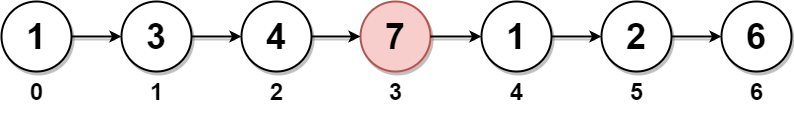

# 快慢指针 中间结点

## 876. Middle of the Linked List 链表的中间结点 简单

给你单链表的头结点 head ，请你找出并返回链表的中间结点。

如果有两个中间结点，则返回第二个中间结点。


示例 1：

> 
>
> 输入：head = [1,2,3,4,5]
> 
> 输出：[3,4,5]
>
> 解释：链表只有一个中间结点，值为 3 。

示例 2：

> 
>
> 输入：head = [1,2,3,4,5,6]
>
> 输出：[4,5,6]
>
> 解释：该链表有两个中间结点，值分别为 3 和 4 ，返回第二个结点。

提示：

- 链表的结点数范围是 [1, 100]
- 1 <= Node.val <= 100

```
class Solution {
    public ListNode middleNode(ListNode head) {
        // 快指针每次走两步，慢指针每次走一步
        ListNode slow = head, fast = head;
        while (fast != null && fast.next != null) {
            slow = slow.next;         // 慢指针走一步
            fast = fast.next.next;    // 快指针走两步
        }
        // 当快指针到达末尾时，慢指针正好在中间
        return slow;
    }
}
```

- 时间复杂度：O(n)
- 空间复杂度：O(1)

**说明：** 一次遍历，双指针无额外空间，是最优解。

## 2095. Delete the Middle Node of a Linked List 删除链表的中间节点 中等

给你一个链表的头节点 head 。删除 链表的 中间节点 ，并返回修改后的链表的头节点 head 。

长度为 n 链表的中间节点是从头数起第 ⌊n / 2⌋ 个节点（下标从 0 开始），其中 ⌊x⌋ 表示小于或等于 x 的最大整数。

对于 n = 1、2、3、4 和 5 的情况，中间节点的下标分别是 0、1、1、2 和 2 。
 
示例 1：

> 
>
> 输入：head = [1,3,4,7,1,2,6]
> 
> 输出：[1,3,4,1,2,6]
>
> 解释：
> 
> 上图表示给出的链表。节点的下标分别标注在每个节点的下方。
>
> 由于 n = 7 ，值为 7 的节点 3 是中间节点，用红色标注。
>
> 返回结果为移除节点后的新链表。 

示例 2：

> 
>
> 输入：head = [1,2,3,4]
>
> 输出：[1,2,4]
>
> 解释：

> 上图表示给出的链表。

> 对于 n = 4 ，值为 3 的节点 2 是中间节点，用红色标注。

示例 3：

> 
>
> 输入：head = [2,1]
>
> 输出：[2]
>
> 解释：
>
> 上图表示给出的链表。
>
> 对于 n = 2 ，值为 1 的节点 1 是中间节点，用红色标注。
>
> 值为 2 的节点 0 是移除节点 1 后剩下的唯一一个节点。
 
提示：

- 链表中节点的数目在范围 [1, 105] 内
- 1 <= Node.val <= 105

```
// 使用 dummy 结点的解法（快慢指针 + 前驱节点记录 + dummy头）
class Solution {
    public ListNode deleteMiddle(ListNode head) {
        // 虚拟头结点，简化删除逻辑
        ListNode dummy = new ListNode(-1, head);
        ListNode slow = head;
        ListNode fast = head;
        ListNode prev = dummy;
        
        // 快慢指针：fast 每次走两步，slow 每次走一步
        while (fast != null && fast.next != null) {
            prev = slow;
            slow = slow.next;
            fast = fast.next.next;
        }

        // 删除中间节点：prev 是 slow 的前一个节点
        prev.next = slow.next;
        return dummy.next;
    }
}
```

- 时间复杂度：O(n)，单次遍历
- 空间复杂度：O(1)，仅使用常数指针

## 19. Remove Nth Node From End of List 删除链表的倒数第 N 个结点 中等

给你一个链表，删除链表的倒数第 n 个结点，并且返回链表的头结点。

示例 1：

> 
>
> 输入：head = [1,2,3,4,5], n = 2
>
> 输出：[1,2,3,5]

示例 2：

> 输入：head = [1], n = 1
>
> 输出：[]

示例 3：

> 输入：head = [1,2], n = 1
>
> 输出：[1]
 

提示：

- 链表中结点的数目为 sz
- 1 <= sz <= 30
- 0 <= Node.val <= 100
- 1 <= n <= sz
 
进阶：你能尝试使用一趟扫描实现吗？

```
class Solution {
    public ListNode removeNthFromEnd(ListNode head, int n) {
        // 创建一个虚拟头节点，方便处理删除头节点的情况
        ListNode dummy = new ListNode(0);
        dummy.next = head;

        // 初始化快慢指针
        ListNode fast = dummy;
        ListNode slow = dummy;

        // 快指针先向前移动 n 步
        for (int i = 0; i < n; i++) {
            fast = fast.next;
        }

        // 同时移动快慢指针，直到快指针到达链表末尾
        while (fast != null && fast.next != null) {
            fast = fast.next;
            slow = slow.next;
        }

        // 此时 slow 指向倒数第 n 个节点的前一个节点
        // 将 slow 的 next 指向下下个节点，从而删除倒数第 n 个节点
        slow.next = slow.next.next;

        return dummy.next;
    }
}
```

- 时间复杂度：O(n) 一次遍历链表，n 为链表长度。
- 空间复杂度：O(1) 使用常数指针。

**说明：** 推荐写法，健壮、高效，处理所有边界问题。


## 面试题 02.02. Kth Node From End of List 返回倒数第 k 个节点 

实现一种算法，找出单向链表中倒数第 k 个节点。返回该节点的值。

**注意：** 本题相对原题稍作改动

示例：

> 输入： 1->2->3->4->5 和 k = 2
>
> 输出： 4

**说明：**

给定的 k 保证是有效的。

快慢指针法（最优解）

```
// 最优解：一次遍历，快慢指针
class Solution {
    public ListNode kthToLast(ListNode head, int k) {
        ListNode fast = head;
        ListNode slow = head;

        // 快指针先走 k 步
        for (int i = 0; i < k; i++) {
            fast = fast.next;
        }

        // 快慢指针同时走，直到 fast 到尾部
        while (fast != null) {
            fast = fast.next;
            slow = slow.next;
        }

        // 此时 slow 就是倒数第 k 个节点
        return slow;
    }
}
```
- 时间复杂度：O(n) 一次遍历链表即可，n 是链表长度。
- 空间复杂度：O(1) 只使用常数级别的指针。

**说明：** 这是最推荐、最高效的方法，时间空间最优，逻辑清晰。


## 143. Reorder List 重排链表 中等

给定一个单链表 L 的头节点 head ，单链表 L 表示为：

> L0 → L1 → … → Ln - 1 → Ln

请将其重新排列后变为：

> L0 → Ln → L1 → Ln - 1 → L2 → Ln - 2 → …

不能只是单纯的改变节点内部的值，而是需要实际的进行节点交换。

示例 1：

> 
>
> 输入：head = [1,2,3,4]
>
> 输出：[1,4,2,3]

示例 2：

> 
>
> 输入：head = [1,2,3,4,5]
>
> 输出：[1,5,2,4,3]
 
提示：

- 链表的长度范围为 [1, 5 * 10<sup>4</sup>]
- 1 <= node.val <= 1000

**快慢指针 + 链表反转 + 合并（最优解 ✅）**

**思路分 3 步：**

1. 使用快慢指针找中点
2. 反转后半部分链表
3. 合并前半和后半链表

```
class Solution {
    public void reorderList(ListNode head) {
        if (head == null || head.next == null) {
            return;
        }

        // 1. 快慢指针找中点
        ListNode fast = head, slow = head;
        while (fast != null && fast.next != null) {
            slow = slow.next;
            fast = fast.next.next;
        }

        // 2. 反转后半部分链表
        ListNode secondHalf = reverseList(slow.next);
        // 截断前后两部分
        slow.next = null;

        // 3. 合并两部分
        mergeLists(head, secondHalf);
    }

    private ListNode reverseList(ListNode head) {
        ListNode prev = null;
        ListNode curr = head;
        while (curr != null) {
            ListNode next = curr.next;
            curr.next = prev;
            prev = curr;
            curr = next;
        }
        return prev;
    }

    private void mergeLists(ListNode first, ListNode second) {
        while (second != null) {
            ListNode firstNext = first.next;
            ListNode secondNext = second.next;

            first.next = second;
            second.next = firstNext;

            first = firstNext;
            second = secondNext;
        }
    }
}
```

- 时间复杂度：O(n) 找中点、反转链表、合并链表各需 O(n)
- 空间复杂度：O(1) 原地操作，仅用少量指针变量

**说明：** 这是最优解，空间效率最高，思路清晰，面试首选！


## 234. Palindrome Linked List 回文链表 简单

给你一个单链表的头节点 head ，请你判断该链表是否为回文链表。如果是，返回 true ；否则，返回 false 。

示例 1：

> 
>
> 输入：head = [1,2,2,1]
> 
> 输出：true

示例 2：

> 
>
> 输入：head = [1,2]
>
> 输出：false

提示：

- 链表中节点数目在范围[1, 10<sup>5</sup>] 内
- 0 <= Node.val <= 9
 
**进阶：** 你能否用 O(n) 时间复杂度和 O(1) 空间复杂度解决此题？

**快慢指针 + 反转链表 + 对比（最优解 ✅）**

**思路：**

1. 快慢指针找中点
2. 反转后半段链表
3. 比较前后两段是否一致

```
class Solution {
    public boolean isPalindrome(ListNode head) {
        if (head == null || head.next == null) {
            return true;
        }

        // 1. 快慢指针找中点
        ListNode slow = head, fast = head;
        while (fast != null && fast.next != null) {
            slow = slow.next;
            fast = fast.next.next;
        }        

        // 2. 反转后半部分, 与 143. Reorder List 根据实际情况让前一部分或者后一部分多
        ListNode secondHalf = reverseList(slow);

        // 3. 比较前后两段
        ListNode p1 = head;
        ListNode p2 = secondHalf;
        while (p2 != null) {
            if (p1.val != p2.val) {
                return false;
            }
            p1 = p1.next;
            p2 = p2.next;
        }
        return true;
    }

    // 反转链表
    private ListNode reverseList(ListNode head) {
        ListNode prev = null;
        ListNode curr = head;
        while (curr != null) {
            ListNode next = curr.next;
            curr.next = prev;
            prev = curr;
            curr = next;
        }
        return prev;
    }    
}
```

- 时间复杂度：O(n)
- 空间复杂度：O(1)

原地操作，性能最优，是实际面试最推荐写法。


## 21. Merge Two Sorted Lists 合并两个有序链表 简单

将两个升序链表合并为一个新的 **升序** 链表并返回。新链表是通过拼接给定的两个链表的所有节点组成的。 

示例 1：

> 
>
> 输入：l1 = [1,2,4], l2 = [1,3,4]
>
> 输出：[1,1,2,3,4,4]

示例 2：

> 输入：l1 = [], l2 = []
>
> 输出：[]

示例 3：

> 输入：l1 = [], l2 = [0]
>
> 输出：[0]
 
提示：

- 两个链表的节点数目范围是 [0, 50]
- -100 <= Node.val <= 100
- l1 和 l2 均按 **非递减顺序** 排列

**解法一：迭代合并（最优解 ✅）**

```
// ✅ 最优解：原地合并，时间 O(n)，空间 O(1)
class Solution {
    public ListNode mergeTwoLists(ListNode list1, ListNode list2) {
        // 虚拟头结点，方便统一操作
        ListNode dummy = new ListNode(-1);
        ListNode curr = dummy;

        // 遍历两个链表，比较大小依次添加
        while (list1 != null && list2 != null) {
            if (list1.val <= list2.val) {
                curr.next = list1;
                list1 = list1.next;
            } else {
                curr.next = list2;
                list2 = list2.next;
            }
            curr = curr.next;
        }

        // 剩下的直接接上
        curr.next = (list1 != null) ? list1 : list2;

        return dummy.next;
    }
}
```

- 时间复杂度：O(n + m) n、m 分别是两个链表长度
- 空间复杂度：O(1) 原地操作，只用常数指针

说明：这是最推荐解法，空间效率最高

**解法二：递归合并**

```
class Solution {
    public ListNode mergeTwoLists(ListNode list1, ListNode list2) {
        // 任一为空直接返回另一个
        if (list1 == null) return list2;
        if (list2 == null) return list1;

        if (list1.val <= list2.val) {
            list1.next = mergeTwoLists(list1.next, list2);
            return list1;
        } else {
            list2.next = mergeTwoLists(list1, list2.next);
            return list2;
        }
    }
}
```

- 时间复杂度：O(n + m)
- 空间复杂度：O(n + m)（递归栈）

⚠️ 简洁但递归层数可能较深，不适用于大数据量链表（容易栈溢出）


## 23. Merge k Sorted Lists 合并 K 个升序链表 困难

给你一个链表数组，每个链表都已经按升序排列。

请你将所有链表合并到一个升序链表中，返回合并后的链表。

 
示例 1：

> 输入：lists = [[1,4,5],[1,3,4],[2,6]]
>
> 输出：[1,1,2,3,4,4,5,6]
>
> 解释：链表数组如下：
>
> [
>
>   1->4->5,
>   1->3->4,
>
>   2->6
>
> ]
>
> 将它们合并到一个有序链表中得到。
>
> 1->1->2->3->4->4->5->6

示例 2：

> 输入：lists = []
>
> 输出：[]

示例 3：

> 输入：lists = [[]]
>
> 输出：[]
 
提示：

- k == lists.length
- 0 <= k <= 10^4
- 0 <= lists[i].length <= 500
- -10^4 <= lists[i][j] <= 10^4
- lists[i] 按 **升序** 排列
- lists[i].length 的总和不超过 10^4


**解法一：优先队列（小顶堆）合并（最优解 ✅）**

**核心思想：** 利用最小堆，每次取出最小节点，接入新链表。


```
class Solution {
    public ListNode mergeKLists(ListNode[] lists) {
        if (lists == null || lists.length == 0) {
            return null;
        }   

        // 小顶堆，按节点值升序排列
        PriorityQueue<ListNode> heap = new PriorityQueue<>((a, b) -> a.val - b.val);

        // 初始化：将每个链表的头结点加入堆中
        for (ListNode list : lists) {
            if (list != null) {
                heap.offer(list);
            }
        }

        ListNode dummy = new ListNode(-1);
        ListNode curr = dummy;

        // 每次取最小值节点
        while (!heap.isEmpty()) {
            ListNode node = heap.poll();
            curr.next = node;
            curr = curr.next;
            
            if (node.next != null) {
                heap.offer(node.next);
            }
        }

        return dummy.next;
    }
}
```

- 时间复杂度：O(N log k) N 是所有节点总数，k 是链表数量 每个节点最多入堆/出堆一次，堆操作为 log k
- 空间复杂度：O(k) 堆最大存储 k 个节点

说明：最优解，适用于 k 很大时，性能稳定，面试首选。

**解法二：分治合并（递归合并两两链表）**

```
class Solution {
    public ListNode mergeKLists(ListNode[] lists) {
        if (lists == null || lists.length == 0) {
            return null;
        }     

        return mergeKLists(lists, 0, lists.length - 1);
    }

    private ListNode mergeKLists(ListNode[] lists, int l, int r) {
        if (l == r) {
            return lists[l];
        }

        int mid = l + (r - l) / 2;
        return mergeTwoLists(mergeKLists(lists, l, mid), mergeKLists(lists, mid + 1, r));
    }

    private ListNode mergeTwoLists(ListNode list1, ListNode list2) {
        // 虚拟头结点，方便统一操作
        ListNode dummy = new ListNode(-1);
        ListNode curr = dummy;

        // 遍历两个链表，比较大小依次添加
        while (list1 != null && list2 != null) {
            if (list1.val <= list2.val) {
                curr.next = list1;
                list1 = list1.next;
            } else {
                curr.next = list2;
                list2 = list2.next;
            }
            curr = curr.next;
        }

        // 剩下的直接接上
        curr.next = (list1 != null) ? list1 : list2;

        return dummy.next;
    }
}
```

N 是所有节点总数，k 是链表数量
- 时间复杂度：O(N log k) 每轮合并两两链表，log k 层，每层最多 O(N) 总合并量
- 空间复杂度：O(log k) 递归栈深度 log k

说明：性能与堆解法相当，代码结构清晰，适合面试手写。

