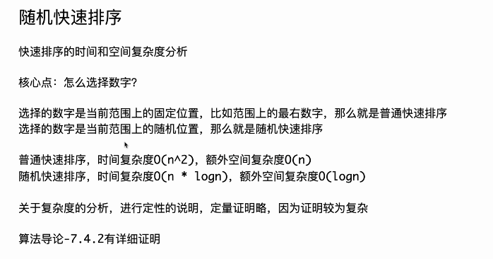

- [215.  Kth Largest Element in an Array 数组中的第K个最大元素 中等](#215--kth-largest-element-in-an-array-数组中的第k个最大元素-中等)

## 215.  Kth Largest Element in an Array 数组中的第K个最大元素 中等

给定整数数组 nums 和整数 k，请返回数组中第 k 个最大的元素。

请注意，你需要找的是数组排序后的第 k 个最大的元素，而不是第 k 个不同的元素。

你必须设计并实现时间复杂度为 O(n) 的算法解决此问题。 

示例 1:

> 输入: [3,2,1,5,6,4], k = 2
> 
> 输出: 5
>

示例 2:

> 输入: [3,2,3,1,2,4,5,5,6], k = 4
> 
> 输出: 4
 
提示：

- 1 <= k <= nums.length <= 10<sup>5</sup>
- -10<sup>4</sup> <= nums[i] <= 10<sup>4</sup>




[左程云 023随机快速排序](https://github.com/algorithmzuo/algorithm-journey/blob/main/src/class023/Code02_QuickSort.java)

```
class Solution {
    public int[] sortArray(int[] nums) {
        quickSort(nums, 0, nums.length - 1);
        return nums;
    }

    private void quickSort(int[] arr, int l, int r) {
        // l == r，只有一个数
        // l > r，范围不存在，不用管        
        if (l >= r) {
            return;
        }
        // 随机这一下，常数时间比较大
        // 但只有这一下随机，才能在概率上把快速排序的时间复杂度收敛到O(n * logn)
        // l......r 随机选一个位置，x这个值，做划分 
        // Math.random() 方法返回一个伪随机的 double 类型数字，范围从0.0到1.0
        int x = arr[l + (int) (Math.random() * (r - l + 1))];
        int[] res = partition(arr, l, r, x);
        // 为了防止底层的递归过程覆盖全局变量
        // 这里用临时变量记录first、last
        int left = res[0];
        int right = res[1];
        quickSort(arr, l, left - 1);
        quickSort(arr, right + 1, r);
    }

    // 荷兰国旗问题 分为三部分
    // 已知arr[l....r]范围上一定有x这个值
    // 划分数组 <x放左边，==x放中间，>x放右边
    // 把全局变量first, last，更新成==x区域的左右边界
    private int[] partition(int[] arr, int l, int r, int x) {
        int first = l;
        int last = r;
        int i = l;
        while (i <= last) {
            if (arr[i] == x) {
                i++;
            } else if (arr[i] < x) {
                swap(arr, first++, i++);
            } else {
                swap(arr, i, last--);
            }
        }
        return new int[] { first, last };
    }

    private void swap(int[] arr, int i, int j) {
        int tmp = arr[i];
        arr[i] = arr[j];
        arr[j] = tmp;
    }
}
```