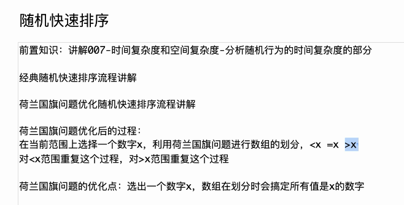
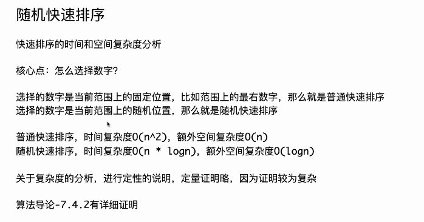
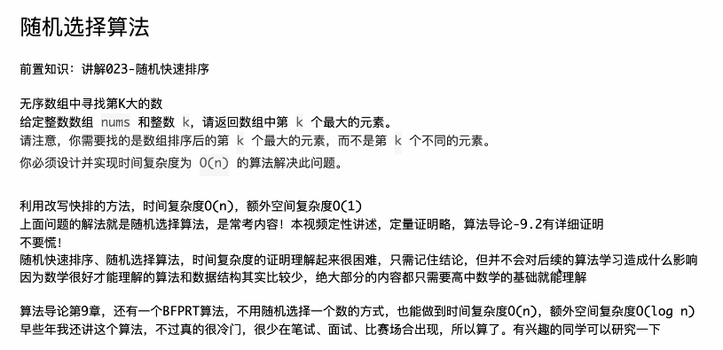

## 912. Sort an Array 排序数组 中等

给你一个整数数组 nums，请你将该数组升序排列。

你必须在 **不使用任何内置函数** 的情况下解决问题，时间复杂度为 O(nlog(n))，并且空间复杂度尽可能小。

示例 1：

> 输入：nums = [5,2,3,1]
> 
> 输出：[1,2,3,5]

示例 2：

> 输入：nums = [5,1,1,2,0,0]
> 
> 输出：[0,0,1,1,2,5]
 
提示：

- 1 <= nums.length <= 5 * 10<sup>4</sup>
- -5 * 10<sup>4</sup> <= nums[i] <= 5 * 10<sup>4</sup>




- [算法讲解023【必备】随机快速排序-代码](https://github.com/algorithmzuo/algorithm-journey/blob/main/src/class023/Code02_QuickSort.java)
- [算法讲解023【必备】随机快速排序-视频](https://www.bilibili.com/video/BV1cc411F7Y6/?share_source=copy_web&vd_source=59203eaa2a5b43acef991f52c90c9743)

```
class Solution {
    public int[] sortArray(int[] nums) {
        quickSort(nums, 0, nums.length - 1);
        return nums;
    }

    private void quickSort(int[] arr, int l, int r) {
        // l == r，只有一个数
        // l > r，范围不存在，不用管        
        if (l >= r) {
            return;
        }
        // 随机这一下，常数时间比较大
        // 但只有这一下随机，才能在概率上把快速排序的时间复杂度收敛到O(n * logn)
        // l......r 随机选一个位置，x这个值，做划分 
        // Math.random() 方法返回一个伪随机的 double 类型数字，范围从0.0到1.0
        int x = arr[l + (int) (Math.random() * (r - l + 1))];
        int[] res = partition(arr, l, r, x);
        // 为了防止底层的递归过程覆盖全局变量
        // 这里用临时变量记录first、last
        int left = res[0];
        int right = res[1];
        quickSort(arr, l, left - 1);
        quickSort(arr, right + 1, r);
    }

    // 荷兰国旗问题 分为三部分
    // 已知arr[l....r]范围上一定有x这个值
    // 划分数组 <x放左边，==x放中间，>x放右边
    // 把全局变量first, last，更新成==x区域的左右边界
    private int[] partition(int[] arr, int l, int r, int x) {
        int first = l;
        int last = r;
        int i = l;
        while (i <= last) {
            if (arr[i] == x) {
                i++;
            } else if (arr[i] < x) {
                swap(arr, first++, i++);
            } else {
                swap(arr, i, last--);
            }
        }
        return new int[] { first, last };
    }

    private void swap(int[] arr, int i, int j) {
        int tmp = arr[i];
        arr[i] = arr[j];
        arr[j] = tmp;
    }
}
```

## 215.  Kth Largest Element in an Array 数组中的第K个最大元素 中等

给定整数数组 nums 和整数 k，请返回数组中第 k 个最大的元素。

请注意，你需要找的是数组排序后的第 k 个最大的元素，而不是第 k 个不同的元素。

你必须设计并实现时间复杂度为 O(n) 的算法解决此问题。 

示例 1:

> 输入: [3,2,1,5,6,4], k = 2
> 
> 输出: 5
>

示例 2:

> 输入: [3,2,3,1,2,4,5,5,6], k = 4
> 
> 输出: 4
 
提示：

- 1 <= k <= nums.length <= 10<sup>5</sup>
- -10<sup>4</sup> <= nums[i] <= 10<sup>4</sup>



- [算法讲解024【必备】随机选择算法-代码](https://github.com/algorithmzuo/algorithm-journey/blob/main/src/class024/RandomizedSelect.java)
- [算法讲解024【必备】随机选择算法-视频](https://www.bilibili.com/video/BV1mN411b71K/?share_source=copy_web&vd_source=59203eaa2a5b43acef991f52c90c9743)

```
class Solution {
    // 随机选择算法，时间复杂度O(n)
    public int findKthLargest(int[] nums, int k) {
        return randomizedSelect(nums, nums.length - k);
    }

    // 如果arr排序的话，在i位置的数字是什么
    private int randomizedSelect(int[] arr, int i) {
        int res = 0;
        int l = 0, r = arr.length - 1;
        while (l <= r) {
			// 随机这一下，常数时间比较大
			// 但只有这一下随机，才能在概率上把时间复杂度收敛到O(n)            
            int[] range = partition(arr, l, r, arr[l + (int) (Math.random() * (r - l + 1))]);
            int first = range[0], last = range[1];
			// 因为左右两侧只需要走一侧
			// 所以不需要临时变量记录全局的first、last
			// 直接用即可            
            if (i < first) {
                r = first - 1;
            } else if (i > last) {
                l = last + 1;
            } else {
                res = arr[i];
                break;
            }
        }
        return res;
    }

    // 荷兰国旗问题
    private int[] partition(int[] arr, int l, int r, int x) {
        int first = l;
        int last = r;
        int i = l;
        while (i <= last) {
            if (arr[i] == x) {
                i++;
            } else if (arr[i] < x) {
                swap(arr, first++, i++);
            } else {
                swap(arr, i, last--);
            }
        }
        return new int[] {first, last};
    }

    private void swap(int[] arr, int i, int j) {
        int tmp = arr[i];
        arr[i] = arr[j];
        arr[j] = tmp;
    }
}
```

## 75. Sort Colors 颜色分类 中等

给定一个包含红色、白色和蓝色、共 n 个元素的数组 nums ，**原地** 对它们进行排序，使得相同颜色的元素相邻，并按照红色、白色、蓝色顺序排列。

我们使用整数 0、 1 和 2 分别表示红色、白色和蓝色。

必须在不使用库内置的 sort 函数的情况下解决这个问题。

示例 1：

> 输入：nums = [2,0,2,1,1,0]
> 
> 输出：[0,0,1,1,2,2]

示例 2：

> 输入：nums = [2,0,1]
> 
> 输出：[0,1,2]
 
提示：

- n == nums.length
- 1 <= n <= 300
- nums[i] 为 0、1 或 2

**进阶**：你能想出一个仅使用常数空间的一趟扫描算法吗？

```
// Time: O(n) Space: O(1)
// 荷兰国旗问题 看左程云 算法讲解023【必备】随机快速排序
class Solution {
    public void sortColors(int[] nums) {
        int l = 0, r = nums.length - 1;
        int i = 0;
        while (i <= r) {
            if (nums[i] == 1) {
                i++;
            } else if (nums[i] == 0) {
                swap(nums, l++, i++);
            } else if (nums[i] == 2) {
                swap(nums, i, r--);
            } 
        }
    }

    private void swap(int[] nums, int i, int j){
        int tmp = nums[i];
        nums[i] = nums[j];
        nums[j] = tmp;
    }
}
```

## 905. Sort Array By Parity 按奇偶排序数组 简单

给你一个整数数组 nums，将 nums 中的的所有偶数元素移动到数组的前面，后跟所有奇数元素。

返回满足此条件的 **任一数组** 作为答案。

示例 1：

> 输入：nums = [3,1,2,4]
> 
> 输出：[2,4,3,1]
> 
> 解释：[4,2,3,1]、[2,4,1,3] 和 [4,2,1,3] 也会被视作正确答案。

示例 2：

> 输入：nums = [0]
> 
> 输出：[0]
 
提示：

- 1 <= nums.length <= 5000
- 0 <= nums[i] <= 5000

三路划分（荷兰国旗思想）

我们可以类比如下三类元素：

| 原荷兰国旗问题  | 当前问题映射  |
| -------- | ------- |
| 小于 pivot | 偶数（放左边） |
| 等于 pivot | -（无中间值） |
| 大于 pivot | 奇数（放右边） |

因此可以使用左右指针进行两路分区（其实是三路划分的简化版本）。

双指针 / 荷兰国旗思想

```
class Solution {
    public int[] sortArrayByParity(int[] nums) {
        int l = 0, r = nums.length - 1;
        // 双指针：类似荷兰国旗划分
        while (l < r) {
            if (nums[l] % 2 == 0) {
                l++;    // 如果左边是偶数，跳过
            } else if (nums[r] % 2 == 1) {
                r--;    // 如果右边是奇数，跳过
            } else {
                // 左是奇数，右是偶数，交换
                swap(nums, l++, r--);
            }
        }   
        return nums; 
    }

    private void swap(int[] nums, int i, int j){
        int tmp = nums[i];
        nums[i] = nums[j];
        nums[j] = tmp;
    }
}
```

复杂度分析

- 时间复杂度：O(n)。原数组中每个元素只遍历一次。
- 空间复杂度：O(1)。原地排序，只消耗常数空间。

## 922. Sort Array By Parity II 按奇偶排序数组 II 简单

给定一个非负整数数组 nums，  nums 中一半整数是 **奇数** ，一半整数是 **偶数** 。

对数组进行排序，以便当 nums[i] 为奇数时，i 也是 **奇数** ；当 nums[i] 为偶数时， i 也是 **偶数** 。

你可以返回 任何满足上述条件的数组作为答案 。

示例 1：

> 输入：nums = [4,2,5,7]
> 
> 输出：[4,5,2,7]
> 
> 解释：[4,7,2,5]，[2,5,4,7]，[2,7,4,5] 也会被接受。

示例 2：

> 输入：nums = [2,3]
> 
> 输出：[2,3]
 
提示：

- 2 <= nums.length <= 2 * 10<sup>4</sup>
- nums.length 是偶数
- nums 中一半是偶数
- 0 <= nums[i] <= 1000
 
**进阶**：可以不使用额外空间解决问题吗？

解题思路与荷兰国旗问题类比：
这不是典型的三段式划分，但可以看成是：

| 类别   | 位置要求    |
| ---- | ------- |
| 偶数元素 | 应放在偶数索引 |
| 奇数元素 | 应放在奇数索引 |

与“荷兰国旗”中的“分组放置”思想一致，即“分类 + 放到正确区域”。

解法：双指针（偶数指针走偶数位，奇数指针走奇数位）

```
class Solution {
    public int[] sortArrayByParityII(int[] nums) {
        int n = nums.length;
        int even = 0; // 指向偶数位索引
        int odd = 1; // 指向奇数位索引
        while (even < n && odd < n) {
            // 找错放在偶数位的奇数
            while (even < n && nums[even] % 2 == 0) {
                even += 2;
            }
            // 找错放在奇数位的偶数
            while (odd < n && nums[odd] % 2 == 1) {
                odd += 2;
            }

            // 交换两个错误位置的元素
            if (even < n && odd < n) {
                swap(nums, even, odd);
                even += 2;
                odd += 2;
            }
        }
        return nums;
    }

    private void swap(int[] nums, int i, int j) {
        int tmp = nums[i];
        nums[i] = nums[j];
        nums[j] = tmp;
    }
}
```

时间与空间复杂度

| 项目    | 复杂度         |
| ----- | ----------- |
| 时间复杂度 | `O(n)`      |
| 空间复杂度 | `O(1)` 原地交换 |

280. Wiggle Sort 摆动排序 中等

给你一个的整数数组 nums, 将该数组重新排序后使 nums[0] <= nums[1] >= nums[2] <= nums[3]... 

输入数组总是有一个有效的答案。

示例 1:

> 输入：nums = [3,5,2,1,6,4]
> 
> 输出：[3,5,1,6,2,4]
> 
> 解释：[1,6,2,5,3,4]也是有效的答案

示例 2:

> 输入：nums = [6,6,5,6,3,8]
> 
> 输出：[6,6,5,6,3,8]

提示：

- 1 <= nums.length <= 5 * 104
- 0 <= nums[i] <= 104
- 输入的 nums 保证至少有一个答案。

**进阶**：你能在 O(n) 时间复杂度下解决这个问题吗？

一趟扫描 + 按位交换（荷兰国旗思想）

```java
class Solution {
    public void wiggleSort(int[] nums) {
        // 遍历数组，按索引奇偶位进行判断和交换
        for (int i = 0; i < nums.length - 1; i++) {
            if (i % 2 == 0) {
                // 偶数位：nums[i] 应该 <= nums[i + 1]
                if (nums[i] > nums[i + 1]) {
                    swap(nums, i, i + 1);
                }
            } else {
                // 奇数位：nums[i] 应该 >= nums[i + 1]
                if (nums[i] < nums[i + 1]) {
                    swap(nums, i, i + 1);
                }
            }
        }
    }

    // 辅助函数：交换数组中两个位置
    private void swap(int[] nums, int i, int j) {
        int temp = nums[i]; nums[i] = nums[j]; nums[j] = temp;
    }
}
```

时间与空间复杂度

| 操作    | 复杂度          |
| ----- | ------------ |
| 时间复杂度 | `O(n)`       |
| 空间复杂度 | `O(1)`（原地排序） |

单次遍历完成排序，效率非常高。

## 167. Two Sum II - Input Array Is Sorted 两数之和 II - 输入有序数组 中等

给你一个下标从 **1** 开始的整数数组 numbers ，该数组已按 **非递减顺序排列**  ，请你从数组中找出满足相加之和等于目标数 target 的两个数。如果设这两个数分别是 numbers[index1] 和 numbers[index2] ，则 1 <= index1 < index2 <= numbers.length 。

以长度为 2 的整数数组 [index1, index2] 的形式返回这两个整数的下标 index1 和 index2。

你可以假设每个输入 **只对应唯一的答案** ，而且你 **不可以** 重复使用相同的元素。

你所设计的解决方案必须只使用常量级的额外空间。
 
示例 1：

> 输入：numbers = [2,7,11,15], target = 9
> 
> 输出：[1,2]
> 
> 解释：2 与 7 之和等于目标数 9 。因此 index1 = 1, index2 = 2 。返回 [1, 2] 。

示例 2：

> 输入：numbers = [2,3,4], target = 6
> 
> 输出：[1,3]
> 
> 解释：2 与 4 之和等于目标数 6 。因此 index1 = 1, index2 = 3 。返回 [1, 3] 。

示例 3：

> 输入：numbers = [-1,0], target = -1
> 
> 输出：[1,2]
> 
> 解释：-1 与 0 之和等于目标数 -1 。因此 index1 = 1, index2 = 2 。返回 [1, 2] 。
 
提示：

- 2 <= numbers.length <= 3 * 10<sup>4</sup>
- -1000 <= numbers[i] <= 1000
- numbers 按 **非递减顺序** 排列
- -1000 <= target <= 1000
- **仅存在一个有效答案**

双指针 + 荷兰国旗“左右收缩”思想

```
class Solution {
    public int[] twoSum(int[] numbers, int target) {
        int l = 0, r = numbers.length - 1;

        // 双指针逐步逼近：类似荷兰国旗左右扫描
        while (l < r) {
            int sum = numbers[l] + numbers[r];
            if (sum == target) {
                // 注意返回的是 1-based 索引
                return new int[]{l + 1, r + 1};
            } else if (sum < target) {
                l++; // 太小，左边指针右移（像荷兰国旗向中间靠拢）
            } else {
                r--; // 太大，右边指针左移
            }
        } 
        // 题目保证有解，这里不会执行
        return new int[]{-1, -1};  
    }
}
```
时间与空间复杂度

| 项目    | 复杂度    |
| ----- | ------ |
| 时间复杂度 | `O(n)` |
| 空间复杂度 | `O(1)` |