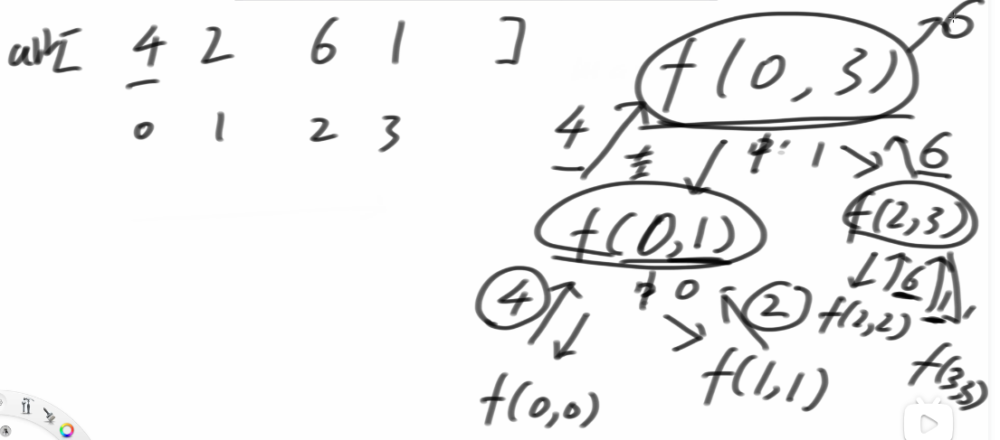
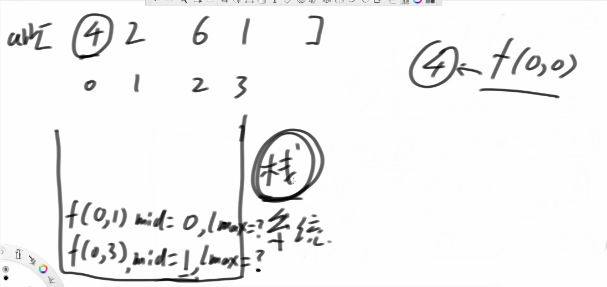

## 算法讲解020【必备】递归和master公式





- [算法讲解020【必备】递归和master公式-代码](https://github.com/algorithmzuo/algorithm-journey/blob/main/src/class020/GetMaxValue.java)
- [算法讲解020【必备】递归和master公式-视频](https://www.bilibili.com/video/BV1kV411G7wP/?share_source=copy_web&vd_source=59203eaa2a5b43acef991f52c90c9743)
- [递归压栈过程](【算法讲解020【必备】递归和master公式】 【精准空降到 10:37】 https://www.bilibili.com/video/BV1kV411G7wP/?share_source=copy_web&vd_source=59203eaa2a5b43acef991f52c90c9743&t=637)

```
package class020;

// 用这个例子讲解递归如何执行
public class GetMaxValue {

	public static int maxValue(int[] arr) {
		return f(arr, 0, arr.length - 1);
	}

	// arr[l....r]范围上的最大值
	public static int f(int[] arr, int l, int r) {
		if (l == r) {
			return arr[l];
		}
		int m = (l + r) / 2;
		int lmax = f(arr, l, m);
		int rmax = f(arr, m + 1, r);
		return Math.max(lmax, rmax);
	}

	public static void main(String[] args) {
		int[] arr = { 3, 8, 7, 6, 4, 5, 1, 2 };
		System.out.println("数组最大值 : " + maxValue(arr));
	}
}
```