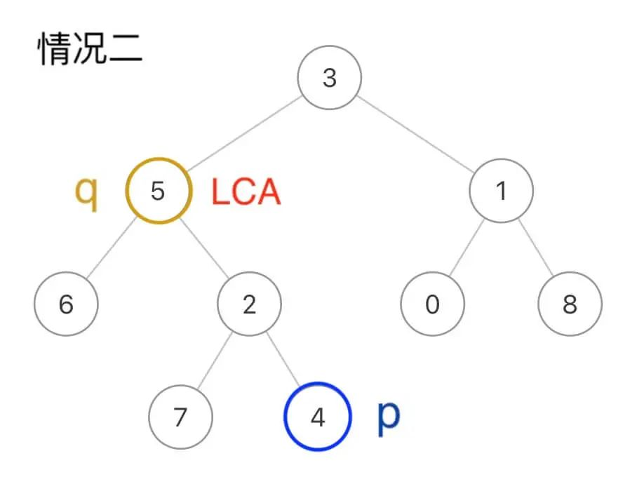

- [236. Lowest Common Ancestor of a Binary Tree 二叉树的最近公共祖先 中等](#236-lowest-common-ancestor-of-a-binary-tree-二叉树的最近公共祖先-中等)
  - [递归解法（最优解）](#递归解法最优解)
- [1676. Lowest Common Ancestor of a Binary Tree IV 二叉树的最近公共祖先 IV 中等](#1676-lowest-common-ancestor-of-a-binary-tree-iv-二叉树的最近公共祖先-iv-中等)
- [1644. Lowest Common Ancestor of a Binary Tree II 二叉树的最近公共祖先 II 中等](#1644-lowest-common-ancestor-of-a-binary-tree-ii-二叉树的最近公共祖先-ii-中等)
  - [递归解法（最优解）](#递归解法最优解-1)
- [235. Lowest Common Ancestor of a Binary Search Tree 二叉搜索树的最近公共祖先 中等](#235-lowest-common-ancestor-of-a-binary-search-tree-二叉搜索树的最近公共祖先-中等)
  - [利用BST左小右大特性的递归解法（最优解）](#利用bst左小右大特性的递归解法最优解)
  - [迭代解法（空间优化）](#迭代解法空间优化)

## 236. Lowest Common Ancestor of a Binary Tree 二叉树的最近公共祖先 中等

给定一个二叉树, 找到该树中两个指定节点的最近公共祖先。

百度百科中最近公共祖先的定义为：“对于有根树 T 的两个节点 p、q，最近公共祖先表示为一个节点 x，满足 x 是 p、q 的祖先且 x 的深度尽可能大（一个节点也可以是它自己的祖先）。”

示例 1：

> 
>
> 输入：root = [3,5,1,6,2,0,8,null,null,7,4], p = 5, q = 1
>
> 输出：3
>
> 解释：节点 5 和节点 1 的最近公共祖先是节点 3 。

示例 2：

> 
>
> 输入：root = [3,5,1,6,2,0,8,null,null,7,4], p = 5, q = 4
> 输出：5
> 解释：节点 5 和节点 4 的最近公共祖先是节点 5 。因为根据定义最近公共祖先节点可以为节点本身。

示例 3：

> 输入：root = [1,2], p = 1, q = 2
>
> 输出：1
 
提示：

- 树中节点数目在范围 [2, 10<sup>5</sup>] 内。
- -10<sup>9</sup> <= Node.val <= 10<sup>9</sup>
- 所有 Node.val 互不相同 。
- p != q
- p 和 q 均存在于给定的二叉树中。

### 递归解法（最优解）

- 时间复杂度：O(n)
- 空间复杂度：O(h)，h为树的高度（递归栈空间）
```
// labuladong p496
class Solution {
    public TreeNode lowestCommonAncestor(TreeNode root, TreeNode p, TreeNode q) {
        // base case
        if (root == null) {
            return root;
        } 

        // 前序位置 解决p和q本身就是LCA节点的问题
        if (root == p || root == q) {
            return root;
        } 

        TreeNode left = lowestCommonAncestor(root.left, p, q);
        TreeNode right = lowestCommonAncestor(root.right, p, q);
        // 后序位置 解决p和q本身不是LCA节点的问题
        if (left != null && right != null) {
            // 当前节点是LCA节点
            return root;
        } 
        return left != null ? left : right;     
    }
}
```

在函数的后序位置，如果发现left和right都非空，就说明当前节点是LCA节点，即解决了第一种情况：


在函数的前序位置，如果找到一个为p或q的节点则直接返回，恰好解决了第二种情况：



因为题目说了p和q一定存在于二叉树中（这点很重要），所以即便我们遇到q就直接返回，根本没遍历到p，也依然可以断定p在q底下，q就是LCA节点。

## 1676. Lowest Common Ancestor of a Binary Tree IV 二叉树的最近公共祖先 IV 中等

给定一棵二叉树的根节点 root 和 TreeNode 类对象的数组（列表） nodes，返回 nodes 中所有节点的最近公共祖先（LCA）。数组（列表）中所有节点都存在于该二叉树中，且二叉树中所有节点的值都是互不相同的。

我们扩展二叉树的最近公共祖先节点在维基百科上的定义：“对于任意合理的 i 值， n 个节点 p<sub>1</sub> 、 p<sub>2</sub>、...、 p<sub>n</sub> 在二叉树 T 中的最近公共祖先节点是后代中包含所有节点 p<sub>i</sub> 的最深节点（我们允许一个节点是其自身的后代）”。一个节点 x 的后代节点是节点 x 到某一叶节点间的路径中的节点 y。

示例 1:

> 
>
> 输入: root = [3,5,1,6,2,0,8,null,null,7,4], nodes = [4,7]
>
> 输出: 2
>
> 解释: 节点 4 和 7 的最近公共祖先是 2。

示例 2:

> 
>
> 输入: root = [3,5,1,6,2,0,8,null,null,7,4], nodes = [1]

> 输出: 1

> 解释: 单个节点的最近公共祖先是该节点本身。

示例 3:

> 
>
> 输入: root = [3,5,1,6,2,0,8,null,null,7,4], nodes = [7,6,2,4]
>
> 输出: 5
>
> 解释: 节点 7、6、2 和 4 的最近公共祖先节点是 5。

示例 4:

> 
>
> 输入: root = [3,5,1,6,2,0,8,null,null,7,4], nodes = [0,1,2,3,4,5,6,7,8]
>
> 输出: 3
>
> 解释: 树中所有节点的最近公共祖先是根节点。

提示:

- 树中节点个数的范围是 [1, 10<sup>4</sup>] 。
- -10<sup>9</sup> <= Node.val <= 10<sup>9</sup>
- 所有的 Node.val 都是互不相同的。
- 所有的 nodes[i] 都存在于该树中。
- 所有的 nodes[i] 都是互不相同的。

本题和 **236. Lowest Common Ancestor of a Binary Tree** 二叉树的最近公共祖先 是一样的

**复杂度分析**

- 时间复杂度：O(n)
- 空间复杂度：O(h)，h为树的高度（递归栈空间）
```
// labuladong p498
class Solution {
    public TreeNode lowestCommonAncestor(TreeNode root, TreeNode[] nodes) {
        // 将列表转化成哈希集合，便于判断元素是否存在
        Set<TreeNode> nodeSet = new HashSet<>();
        for (TreeNode node : nodes) {
            nodeSet.add(node);
        }
        return lowestCommonAncestor(root, nodeSet);
    }

    private TreeNode lowestCommonAncestor(TreeNode root, Set<TreeNode> nodes) {
        if (root == null) {
            return null;
        }
        // 前序位置
        if (nodes.contains(root)) {
            return root;
        }

        TreeNode left = lowestCommonAncestor(root.left, nodes);
        TreeNode right = lowestCommonAncestor(root.right, nodes);
        // 后序位置，已经知道左右子树是否存在目标值
        if (left != null && right != null) {
            // 当前节点是LCA节点
            return root;
        }

        return left != null ? left : right;
    }
}
```

## 1644. Lowest Common Ancestor of a Binary Tree II 二叉树的最近公共祖先 II 中等

给定一棵二叉树的根节点 root，返回给定节点 p 和 q 的最近公共祖先（LCA）节点。如果 p 或 q 之一 **不存在** 于该二叉树中，返回 null。树中的每个节点值都是互不相同的。

根据维基百科中对最近公共祖先节点的定义：“两个节点 p 和 q 在二叉树 T 中的最近公共祖先节点是 后代节点 中既包括 p 又包括 q 的最深节点（我们允许 **一个节点为自身的一个后代节点** ）”。一个节点 x 的 **后代节点** 是节点 x 到某一叶节点间的路径中的节点 y。

示例 1:

> 
>
> 输入： root = [3,5,1,6,2,0,8,null,null,7,4], p = 5, q = 1
>
> 输出： 3
>
> 解释： 节点 5 和 1 的共同祖先节点是 3。

示例 2:

> 
>
> 输入： root = [3,5,1,6,2,0,8,null,null,7,4], p = 5, q = 4
>
> 输出： 5
>
> 解释： 节点 5 和 4 的共同祖先节点是 5。根据共同祖先节点的定义，一个节点可以是自身的后代节点。

示例 3:

> 
>
> 输入： root = [3,5,1,6,2,0,8,null,null,7,4], p = 5, q = 10
>
> 输出： null
>
> 解释： 节点 10 不存在于树中，所以返回 null。
 
提示:

- 树中节点个数的范围是 [1, 10<sup>4</sup>]
- -10<sup>9</sup> <= Node.val <= 10<sup>9</sup>
- 所有节点的值 Node.val 互不相同
- p != q
 
**进阶**： 在不检查节点是否存在的情况下，你可以遍历树找出最近公共祖先节点吗？

### 递归解法（最优解）

注：
- 需要两个boolean变量判断p和q是否存在于二叉树中
- 都需要在后序位置处理，因为p或者q可能不存在于二叉树中

**复杂度分析**

- 时间复杂度：O(n)
- 空间复杂度：O(h)，h为树的高度（递归栈空间）

```
// labuladong p500
class Solution {
    // 用于记录p和q是否存在于二叉树中
    boolean foundP = false, foundQ = false;

    public TreeNode lowestCommonAncestor(TreeNode root, TreeNode p, TreeNode q) {
        TreeNode lca = helper(root, p, q);
        return foundP && foundQ ? lca : null;
    }

    // 在二叉树中寻找p和q的最近公共祖先节点
    private TreeNode helper(TreeNode root, TreeNode p, TreeNode q) {
        if (root == null) {
            return null;
        }

        TreeNode left = helper(root.left, p, q);
        TreeNode right = helper(root.right, p, q);
        // 后序位置，判断当前节点是不是LCA节点
        if (left != null && right != null) {
            return root;
        }

        // 后序位置，判断当前节点是不是目标值
        if (root == p) {
            foundP = true;
            return root;
        }

        if (root == q) {
            foundQ = true;
            return root;
        }

        return left != null ? left : right;
    }
}
```

## 235. Lowest Common Ancestor of a Binary Search Tree 二叉搜索树的最近公共祖先 中等

给定一个二叉搜索树, 找到该树中两个指定节点的最近公共祖先。

百度百科中最近公共祖先的定义为：“对于有根树 T 的两个结点 p、q，最近公共祖先表示为一个结点 x，满足 x 是 p、q 的祖先且 x 的深度尽可能大（**一个节点也可以是它自己的祖先**）。”

例如，给定如下二叉搜索树:  root = [6,2,8,0,4,7,9,null,null,3,5]


示例 1:

> 输入: root = [6,2,8,0,4,7,9,null,null,3,5], p = 2, q = 8
>
> 输出: 6 
>
> 解释: 节点 2 和节点 8 的最近公共祖先是 6。

示例 2:

> 输入: root = [6,2,8,0,4,7,9,null,null,3,5], p = 2, q = 4
>
> 输出: 2
>
> 解释: 节点 2 和节点 4 的最近公共祖先是 2, 因为根据定义最近公共祖先节点可以为节点本身。
 
**说明**:

- 所有节点的值都是唯一的。
- p、q 为不同节点且均存在于给定的二叉搜索树中。

### 利用BST左小右大特性的递归解法（最优解）
- 时间复杂度：O(h)，h为树的高度
- 空间复杂度：O(h)，递归栈空间

```
class Solution {
    public TreeNode lowestCommonAncestor(TreeNode root, TreeNode p, TreeNode q) {
        // 如果p和q都小于当前节点，LCA在左子树
        if (root.val < p.val && root.val < q.val) {
            return lowestCommonAncestor(root.right, p, q);
        }  
        // 如果p和q都大于当前节点，LCA在右子树   
        if (root.val > p.val && root.val > q.val) {
            return lowestCommonAncestor(root.left, p, q);
        }
        // 当前节点就是LCA（p和q位于当前节点两侧）
        return root;
    }
}
```
### 迭代解法（空间优化）
- 时间复杂度：O(h)
- 空间复杂度：O(1)

```
class Solution {
    public TreeNode lowestCommonAncestor(TreeNode root, TreeNode p, TreeNode q) {
        while (root != null) {
            if (p.val < root.val && q.val < root.val) {
                root = root.left;
            } else if (p.val > root.val && q.val > root.val) {
                root = root.right;
            } else {
                return root;
            }
        }
        return null;
    }
}
```
