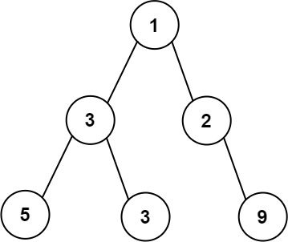
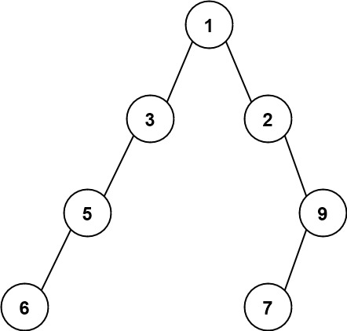
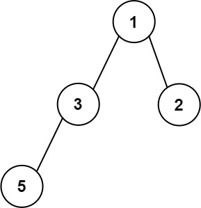
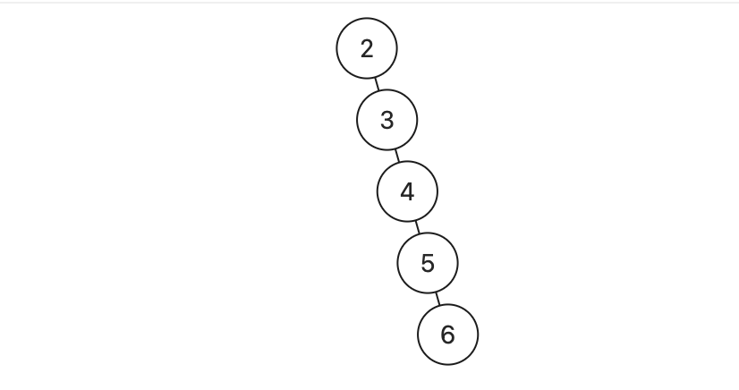

- [二叉树高频题目-上-不含树型dp](#二叉树高频题目-上-不含树型dp)
  - [102. Binary Tree Level Order Traversal 二叉树的层序遍历 中等](#102-binary-tree-level-order-traversal-二叉树的层序遍历-中等)
    - [使用 LinkedList 作为队列](#使用-linkedlist-作为队列)
    - [使用数组实现的队列](#使用数组实现的队列)
  - [103. Binary Tree Zigzag Level Order Traversal 二叉树的锯齿形层序遍历 中等](#103-binary-tree-zigzag-level-order-traversal-二叉树的锯齿形层序遍历-中等)
    - [使用 LinkedList 作为队列](#使用-linkedlist-作为队列-1)
    - [使用数组实现的队列](#使用数组实现的队列-1)
  - [662. Maximum Width of Binary Tree 二叉树最大宽度 中等](#662-maximum-width-of-binary-tree-二叉树最大宽度-中等)
    - [BFS 使用数组作为队列](#bfs-使用数组作为队列)
    - [BFS 使用 LinkedList 作为队列](#bfs-使用-linkedlist-作为队列)
    - [递归](#递归)
  - [104. Maximum Depth of Binary Tree 二叉树的最大深度 简单](#104-maximum-depth-of-binary-tree-二叉树的最大深度-简单)
    - [递归](#递归-1)
  - [111. Minimum Depth of Binary Tree 二叉树的最小深度 简单](#111-minimum-depth-of-binary-tree-二叉树的最小深度-简单)


# 二叉树高频题目-上-不含树型dp

## 102. Binary Tree Level Order Traversal 二叉树的层序遍历 中等

给你二叉树的根节点 root ，返回其节点值的 层序遍历 。 （即逐层地，从左到右访问所有节点）。
 
示例 1：

> 
>
> 输入：root = [3,9,20,null,null,15,7]
>
> 输出：[[3],[9,20],[15,7]]

示例 2：

> 输入：root = [1]
>
> 输出：[[1]]

示例 3：

> 输入：root = []
>
> 输出：[]
 
提示：

- 树中节点数目在范围 [0, 2000] 内
- -1000 <= Node.val <= 1000

### 使用 LinkedList 作为队列

```
class Solution {
    public List<List<Integer>> levelOrder(TreeNode root) {
        List<List<Integer>> res = new ArrayList<>();
        if (root == null) {
            return res;
        }
        
        Queue<TreeNode> q = new LinkedList<>();
        q.offer(root);

        while (!q.isEmpty()) {
            int sz = q.size();
            List<Integer> level = new ArrayList<>();
            for (int i = 0; i < sz; i++) {
                TreeNode curr = q.poll();
                level.add(curr.val);
                if (curr.left != null) {
                    q.offer(curr.left);
                } 
                if (curr.right != null) {
                    q.offer(curr.right);
                }
            }
            res.add(level);
        }
        return res;
    }
}
```

### 使用数组实现的队列

```
class Solution {
    private static final int MAXN = 2001;
    private static TreeNode[] q = new TreeNode[MAXN];
    private static int l, r;

    public List<List<Integer>> levelOrder(TreeNode root) {
        List<List<Integer>> res = new ArrayList<>();
        if (root == null) {
            return res;
        }

        l = 0;
        r = 0;
        q[r++] = root;

        while (l < r) {
            int sz = r - l;
            List<Integer> level = new ArrayList<>();
            for (int i = 0; i < sz; i++) {
                TreeNode curr = q[l++];
                level.add(curr.val);
                if (curr.left != null) {
                    q[r++] = curr.left;
                } 
                if (curr.right != null) {
                    q[r++] = curr.right;
                }
            }
            res.add(level);
        }
        return res;
    }
}
```

## 103. Binary Tree Zigzag Level Order Traversal 二叉树的锯齿形层序遍历 中等

给你二叉树的根节点 root ，返回其节点值的 **锯齿形层序遍历** 。（即先从左往右，再从右往左进行下一层遍历，以此类推，层与层之间交替进行）。

示例 1：

> 
>
> 输入：root = [3,9,20,null,null,15,7]
>
> 输出：[[3],[20,9],[15,7]]

示例 2：

> 输入：root = [1]
>
>输出：[[1]]

示例 3：

> 输入：root = []
>
> 输出：[]
 
提示：

- 树中节点数目在范围 [0, 2000] 内
- -100 <= Node.val <= 100

### 使用 LinkedList 作为队列

```
// level 使用了 LinkedList，为了使用 addLast 和 addFirst
class Solution {
    public List<List<Integer>> zigzagLevelOrder(TreeNode root) {
        List<List<Integer>> res = new ArrayList<>();
        Queue<TreeNode> q = new LinkedList<>();
        if (root != null) {
            q.offer(root);
        }
        boolean left = true;
        while (!q.isEmpty()) {
            List<Integer> level = new LinkedList<>();
            int size = q.size();
            for (int i = 0; i < size; i++) {
                TreeNode cur = q.poll();
                if (left) {
                    level.addLast(cur.val);
                } else {
                    level.addFirst(cur.val);
                }
                if (cur.left != null) {
                    q.offer(cur.left);
                }
                if (cur.right != null) {
                    q.offer(cur.right);
                }
            }
            res.add(level);
            left = !left;
        }
        return res;
    }
}
```
### 使用数组实现的队列

```
class Solution {
    private static final int MAXN = 2001;
    private static TreeNode[] q = new TreeNode[MAXN];
    private static int l, r;

    public List<List<Integer>> zigzagLevelOrder(TreeNode root) {
        List<List<Integer>> res = new ArrayList<>();
        if (root == null) {
            return res;
        } 

        l = 0;
        r = 0;
        q[r++] = root;
        boolean reverse = false;
        
        while (l < r) {
            int sz = r - l;
            List<Integer> level = new ArrayList<>();
            // reverse == false, 左 -> 右， l....r-1, 收集size个
            // reverse == true,  右 -> 左， r-1....l, 收集size个
            // 左 -> 右, p = p + 1
            // 右 -> 左, p = p - 1            
            for (int i = 0, p = reverse ? r - 1 : l, step = reverse ? -1 : 1; i < sz; i++, p += step) {
                TreeNode curr = q[p];
                level.add(curr.val);
            }
            for (int i = 0; i < sz; i++) {
                TreeNode curr = q[l++];
                if (curr.left != null) {
                    q[r++] = curr.left;
                }
                if (curr.right != null) {
                    q[r++] = curr.right;
                }
            }
            res.add(level);
            reverse = !reverse;
        }
        return res;
    }
}
```

## 662. Maximum Width of Binary Tree 二叉树最大宽度 中等

给你一棵二叉树的根节点 root ，返回树的 **最大宽度** 。

树的 **最大宽度** 是所有层中最大的 **宽度** 。

每一层的 **宽度** 被定义为该层最左和最右的非空节点（即，两个端点）之间的长度。将这个二叉树视作与满二叉树结构相同，两端点间会出现一些延伸到这一层的 null 节点，这些 null 节点也计入长度。

题目数据保证答案将会在  **32** 位 带符号整数范围内。

示例 1：

> 
>
> 输入：root = [1,3,2,5,3,null,9]
>
> 输出：4
>
> 解释：最大宽度出现在树的第 3 层，宽度为 4 (5,3,null,9) 。

示例 2：

> 
>
> 输入：root = [1,3,2,5,null,null,9,6,null,7]
>
> 输出：7
>
> 解释：最大宽度出现在树的第 4 层，宽度为 7 (6,null,null,null,null,null,7) 。

示例 3：

> 
>
> 输入：root = [1,3,2,5]
>
> 输出：2
>
> 解释：最大宽度出现在树的第 2 层，宽度为 2 (3,2) 。
 
提示：

- 树中节点的数目范围是 [1, 3000]
- -100 <= Node.val <= 100

### BFS 使用数组作为队列
[代码](https://github.com/algorithmzuo/algorithm-journey/blob/main/src/class036/Code03_WidthOfBinaryTree1.java)
```
class Solution {
    private static final int MAXN = 3001;
    private static TreeNode[] nq = new TreeNode[MAXN];
    private static int[] iq = new int[MAXN];
    private static int l, r;

    public int widthOfBinaryTree(TreeNode root) {
        int res = 1;
        l = 0;   
        r = 0;
        nq[r] = root;
        iq[r++] = 1;
        while (l < r) {
            int sz = r - l;
            res = Math.max(res, iq[r - 1] - iq[l] + 1);
            for (int i = 0; i < sz; i++) {
                TreeNode node = nq[l];
                int id = iq[l++];
                if (node.left != null) {
                    nq[r] = node.left;
                    iq[r++] = id * 2;
                } 
                if (node.right != null) {
                    nq[r] = node.right;
                    iq[r++] = id * 2 + 1;
                }
            }
        }
        return res;
    }
}
```
### BFS 使用 LinkedList 作为队列

```
// 这个使用了peek，不需要判断 i==0
class Solution {
    public int widthOfBinaryTree(TreeNode root) {
        int res = 1;

        Queue<TreeNode> nq = new LinkedList<>();
        Queue<Integer> iq = new LinkedList<>();
        nq.offer(root);
        iq.offer(1); 

        while (!nq.isEmpty()) {
            int sz = nq.size();
            int l = iq.peek();  // 当前层的最左节点编号
            int r = l;          // 当前层的最右节点编号
            for (int i = 0; i < sz; i++) {
                TreeNode node = nq.poll();
                int id = iq.poll();
                r = id;         // 更新最右节点编号
                if (node.left != null) {
                    nq.offer(node.left);
                    iq.offer(id * 2);
                } 
                if (node.right != null) {
                    nq.offer(node.right);
                    iq.offer(id * 2 + 1);
                }
            }
            res = Math.max(res, r - l + 1);
        }
        return res;           
    }
}
```
### 递归

```
class Solution {
    Map<Integer, Integer> levelMin = new HashMap<>();
    int maxWidth = 0;

    public int widthOfBinaryTree(TreeNode root) {
        traverse(root, 1, 1);
        return maxWidth;
    }

    void traverse(TreeNode root, int level, int index) {
        if (root == null) {
            return;
        }

        // 每一层最先访问到的节点会是最左边的节点，即每一层编号的最小值
        levelMin.putIfAbsent(level, index);
        maxWidth = Math.max(maxWidth, index - levelMin.get(level) + 1);
        traverse(root.left, level + 1, index * 2);
        traverse(root.right, level + 1, index * 2 + 1);
    }
}
```

## 104. Maximum Depth of Binary Tree 二叉树的最大深度 简单

给定一个二叉树 root ，返回其最大深度。

二叉树的 **最大深度** 是指从根节点到最远叶子节点的最长路径上的节点数。

示例 1：

> 
>
> 输入：root = [3,9,20,null,null,15,7]
>
> 输出：3

示例 2：

> 输入：root = [1,null,2]
>
> 输出：2
 
提示：

- 树中节点的数量在 [0, 10<sup>4</sup>] 区间内。
- -100 <= Node.val <= 100

### 递归

```
class Solution {
    public int maxDepth(TreeNode root) {
        if (root == null) {
            return 0;
        }    

        int leftDepth = maxDepth(root.left);
        int rightDepth = maxDepth(root.right);
        return Math.max(leftDepth, rightDepth) + 1;
    }
}
```

## 111. Minimum Depth of Binary Tree 二叉树的最小深度 简单

给定一个二叉树，找出其最小深度。

**最小深度** 是从根节点到最近叶子节点的最短路径上的节点数量。

**说明**：叶子节点是指没有子节点的节点。

示例 1：

> 
>
> 输入：root = [3,9,20,null,null,15,7]
>
> 输出：2

示例 2：

> 
>
> 输入：root = [2,null,3,null,4,null,5,null,6]
>
> 输出：5
 

提示：

- 树中节点数的范围在 [0, 10<sup>5</sup>] 内
- -1000 <= Node.val <= 1000

本题和 **104. Maximum Depth of Binary Tree 二叉树的最大深度** 不一样。
- 如果左子树为空，右子树不为空，则最小深度是右子树的深度+1
- 如果右子树为空，左子树不为空，则最小深度是左子树的深度+1
- 如果左右子树都不为空，则最小深度是左右子树深度的最小值+1


```
// 左程云如 示例2，根节点没有左子树，不能让它干扰我们计算，要把它设置为无穷大，当左右节点不为空的时候才能递归。**
class Solution {
    public int minDepth(TreeNode root) {
        if (root == null) {
            // 当前root是空树
            return 0;
        }    
        if (root.left == null && root.right == null) {
            // 当前root是叶子结点
            return 1;
        }    

        int leftDepth = Integer.MAX_VALUE;
        int rightDepth = Integer.MAX_VALUE;

        if (root.left != null) {
            leftDepth = minDepth(root.left);
        }
        
        if (root.right != null) {
            rightDepth = minDepth(root.right);
        }

        return Math.min(leftDepth, rightDepth) + 1;
    }
}
```

如果这么求的话，没有左孩子的分支会算为最短深度。
所以，如果左子树为空，右子树不为空，说明最小深度是 1 + 右子树的深度。
反之，右子树为空，左子树不为空，最小深度是 1 + 左子树的深度。 最后如果左右子树都不为空，返回左右子树深度最小值 + 1 。
[代码随想录](https://programmercarl.com/0111.%E4%BA%8C%E5%8F%89%E6%A0%91%E7%9A%84%E6%9C%80%E5%B0%8F%E6%B7%B1%E5%BA%A6.html#%E6%80%9D%E8%B7%AF)

```
class Solution {
    public int minDepth(TreeNode root) {
        if (root == null) {
            return 0;
        }    

        if (root.left == null && root.right == null) {
            return 1;
        }

        int leftDepth = minDepth(root.left);
        int rightDepth = minDepth(root.right);

        if (root.left == null) {
            return rightDepth + 1;
        }
        if (root.right == null) {
            return leftDepth + 1;
        }

        return Math.min(leftDepth, rightDepth) + 1;
    }
}
```
