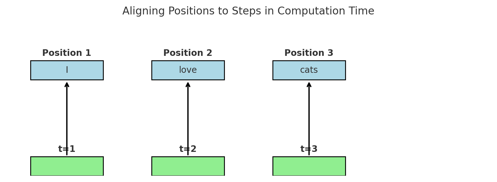

# Attention Is All You Need

## 摘要

主流的序列转换模型主要基于复杂的循环神经网络（RNN）或卷积神经网络（CNN），这些模型通常包括一个编码器和一个解码器。性能最好的模型还通过注意力机制将编码器和解码器连接起来。我们提出了一种全新的、基于注意力机制的简单网络架构——Transformer，它完全摒弃了循环和卷积结构。

在两个机器翻译任务上的实验表明，该模型在翻译质量上更优，同时具有更强的并行能力，训练所需时间也大大减少。在WMT 2014英德翻译任务中，我们的模型取得了28.4的BLEU分数，比现有最好的结果（包括模型集成）提高了超过2个BLEU分。在WMT 2014英法翻译任务中，我们的模型在8块GPU上训练3.5天后，达到了41.8的单模型BLEU分数，创下了新的单模型最佳成绩，而训练成本只是文献中最优模型的一小部分。

我们还展示了Transformer在其他任务上的良好泛化能力，它在处理英语成分句法分析任务时也表现出色，无论是大规模训练数据还是数据有限的情况下都取得了成功。

---

<sup>*</sup>共同贡献，作者排序随机。Jakob 提出了用自注意力机制替代RNN的想法，并率先开展了对这一想法的验证工作。Ashish 与 Illia 一起设计并实现了最初的Transformer模型，并在本项工作的各个方面都发挥了关键作用。Noam 提出了缩放点积注意力机制、多头注意力机制以及无需参数的位置表示方法，是另一位几乎参与所有细节工作的作者。Niki 在我们的初始代码库和 tensor2tensor 中设计、实现、调试并评估了无数模型变体。Llion 也尝试了新颖的模型变体，负责最初的代码库开发、高效的推理实现以及可视化工作。Lukasz 和 Aidan 则花费了无数个日夜设计并实现了 tensor2tensor，替代了我们早期的代码库，极大地提升了实验结果并显著加速了我们的研究进展。

† 工作完成时供职于 Google Brain。

‡ 工作完成时供职于 Google Research。

发表于第31届神经信息处理系统大会（NIPS 2017），地点：美国加利福尼亚州长滩。

---

## 1 引言

这是《Attention Is All You Need》论文的第一部分，它主要讲了几个核心点：

---

### ✅ **背景是什么？**

传统上，处理语言（比如翻译、语言建模）的方法主要是用循环神经网络（RNN）、长短期记忆网络（LSTM）和门控循环单元（GRU）。这些方法已经被广泛认为是效果最好的解决方案。很多研究也在不断改进这些模型。

---

### 🤔 **这些旧方法有什么问题？**

RNN类的模型有一个本质的问题：**它们是一步一步处理的**。也就是说，它只能先处理第一个词，再处理第二个词，然后第三个……所以整个训练过程不能并行，速度慢，特别是在句子很长的时候，更难搞，因为内存不够用，不能批量处理太多句子。

虽然有一些新技术（比如把模型分段计算或只在某些情况下激活部分模型）可以提高效率和效果，但**必须按顺序处理**这个限制还是没有解决。

---

### 🧠 **注意力机制（Attention）是个好东西**

注意力机制可以让模型直接关注输入中的关键部分，不管它们离得远不远。比如翻译时，句子开头的词可能跟句子结尾的词有关，注意力机制能捕捉到这种远距离的关系。

但之前大部分模型都是把注意力和RNN一起用的，还是受限于RNN的“顺序处理”。

---

### 💡 **我们做了啥创新？**

这篇论文提出了一个新模型叫 **Transformer**。它**完全不用RNN，也不用卷积神经网络**，**只靠注意力机制**！

好处是：

* 它可以并行处理所有词，更快；
* 效果还更好；
* 我们用8块P100显卡训练12小时，就在翻译任务上达到了最先进的水平。

---

### 总结一句话：

> 以前翻译模型都靠一步步来的RNN，我们这次干脆不用RNN了，直接用注意力机制来做，还做得更快更好！

---

当然可以！下面我来**逐句**用通俗易懂的语言帮你解释这段话：

---

### 原文：

> **Recurrent models typically factor computation along the symbol positions of the input and output sequences.**

✅ **解释：**
循环神经网络（RNN）这种模型在处理输入和输出的时候，通常是**一个字（或词）一个字地处理**。也就是说，它是**按顺序来处理句子中每一个位置的内容**。

---

“**factor computation**” 是一个在机器学习和数学中常见的术语，字面意思是“将计算进行因式分解”或“分步分解处理”。在这段论文中的语境下，它指的是：**将一个完整的计算任务拆解成若干个更小的、与输入位置相关的步骤来处理。**

我们来**详细拆解一下**这个术语在这里的含义：

---

### 📘 原句：

> "Recurrent models typically factor computation along the symbol positions of the input and output sequences."

### 🧠 翻译直白点是：

> 循环模型通常会**按照输入输出序列中每个符号（比如每个词或字符）的位置，把整个计算任务拆开来做**。

---

### ✅ 通俗解释：

我们以一句话翻译为例，比如英语句子 “I love cats.”：

循环神经网络会像这样做：

1. 第一步处理 “I” → 得到隐藏状态 $h_1$
2. 第二步处理 “love”，用 “love” + 上一步结果 $h_1$ → 得到 $h_2$
3. 第三步处理 “cats”，用 “cats” + $h_2$ → 得到 $h_3$

整个模型不是一下子处理完整句话，而是**把整个计算流程“拆开”（factor）成了每个词一步的计算**。这就是“factor computation along the symbol positions”：

👉 **每个词一个步骤，整个过程就是多个步骤的组合。**

---

### 📌 更技术一点的解释：

> "factor computation" 在深度学习中有时也意味着：**将一个复杂的函数拆分为多个子函数**，比如先做嵌入，再做编码，再做解码，每一层处理一个方面。
> 在RNN中，这种“因式分解”是**沿着时间维度（序列位置）来分解**的——每个时间点/序列位置独立完成一小步。

---

### 🔍 类比举个例子：

就好比你在做一道数学题，传统方法是一步到尾一口气做完。而RNN的思路是：

> 把这道题拆成 3 个步骤，每步都只算当前这一步，必须按顺序完成。
> 这就是 “factor computation along time steps”。

---

### ✍️ 总结一下：

* **factor computation** = 把整体计算任务拆成多个小步骤来做；
* 在 RNN 里，是 **按照词的位置/顺序** 来分步骤处理；
* 好处是结构清晰，但坏处是**不能并行处理**，速度慢。

---

详细解释一下 Aligning the positions to steps in computation time

非常好，这句看起来简单，其实挺关键的，尤其是在理解 RNN 的工作机制时。

---

### 📘 原句：

> **Aligning the positions to steps in computation time**

---

## ✅ 一句话解释：

这句话的意思是：

> **“把每个词（或字符）在序列中的位置，对应到一个具体的计算步骤。”**

也就是说，**模型处理第1个词就是第1步计算，处理第2个词就是第2步计算……每个位置都和计算时间一一对应**。

---

## 🔍 逐层拆解：

### 1. **position（位置）指的是啥？**

就是输入序列中每个词的顺序，比如这个句子：

```
I     love     cats
1      2        3
```

这些数字就是“位置”。

---

### 2. **computation time（计算时间）指的是啥？**

RNN 是**一步一步处理**的，每个时间步（timestep）模型都会执行一次计算。比如：

* 第1步 → 处理第1个词 “I”
* 第2步 → 处理 “love”
* 第3步 → 处理 “cats”

这个处理过程是有**顺序的时间步（time step）**的。

---

### 3. **Aligning… 是什么动作？**

“Aligning” 表示**对齐、对应、配对**。

这里的意思是：

> 把输入中的“第几个词”对齐（对应）到“第几步计算”。

所以：

| 输入位置（Position） | 计算时间（Time step） |
| -------------- | --------------- |
| 1（“I”）         | t = 1           |
| 2（“love”）      | t = 2           |
| 3（“cats”）      | t = 3           |

这就是“Aligning the positions to steps in computation time”。

---

## 🧠 更直白的说法：

RNN 的计算逻辑是：**一个词对应一步计算，不能跳着来，也不能一起算。**

就像你在数数，必须先数1，再数2，最后数3——这个过程不能并行。

---

## 📌 总结一下：

| 原词                           | 通俗解释         |
| ---------------------------- | ------------ |
| Aligning the positions       | 把每个词的位置      |
| to steps in computation time | 和模型的每一步计算对上号 |

➡️ 也就是：
**“模型第几步就处理第几个词，每个词和一个时间步绑定在一起，按顺序来。”**

---



这张图就是对“**Aligning the positions to steps in computation time**”的直观展示：

* 上面蓝色的是输入序列中每个词的位置（Position 1, 2, 3）。
* 下面绿色的是计算时间的步骤（t=1, t=2, t=3）。
* 每个箭头表示：第几个词对应第几步计算。

🔁 就是说：**模型第1步就处理第1个词，第2步处理第2个词……必须按顺序来，不能跳过，也不能一起算。**

这就是RNN的“顺序性”——它不能并行，只能一步一步来。这也正是Transformer想要突破的限制。需要我对比一下Transformer是怎么做的吗？

需要


这张图展示了 **Transformer 和 RNN 的核心区别**：

* 🔵 上方：每个词的位置（Position 1, 2, 3）
* 🟢 下方绿色区域：**Transformer 是“同时处理所有词”**，也就是所谓的“并行计算（Parallel Computation）”
* 每个箭头都指向同一个计算区域，表示这些词**可以一起被处理**

---

### 📌 总结对比：

| 模型          | 如何处理词序列        |
| ----------- | -------------- |
| RNN         | 一步一步来（不能并行）    |
| Transformer | 一次性处理所有词（可以并行） |

这正是 Transformer 更快、更高效的原因之一。
如果你还想了解“Transformer 是怎么做到并行”的，比如多头注意力或位置编码，我也可以继续讲解。

---

### 原文：

> **Aligning the positions to steps in computation time, they generate a sequence of hidden states ht, as a function of the previous hidden state ht−1 and the input for position t.**

✅ **解释：**
这个模型在每一步都会生成一个“隐藏状态”（可以理解为当前处理结果的中间记忆），叫做 $h_t$。这个状态是根据两个东西算出来的：

1. 上一步的隐藏状态 $h_{t-1}$
2. 当前这一步输入的词（比如第t个词）

简单说就是：**当前的处理结果，取决于你上一步的结果加上这一步的输入**。

---

### 原文：

> **This inherently sequential nature precludes parallelization within training examples, which becomes critical at longer sequence lengths, as memory constraints limit batching across examples.**

✅ **解释：**
因为这个模型必须**一步一步处理**（比如必须先处理第1个词，才能处理第2个词），所以它**不能并行处理同一个句子里的所有词**。
这在句子很长的时候就成了大问题，因为：

* 并行不了 → 慢；
* 每次只能处理有限数量的句子 → **内存不够，批处理数量受限**。

---

### 原文：

> **Recent work has achieved significant improvements in computational efficiency through factorization tricks \[21] and conditional computation \[32], while also improving model performance in case of the latter.**

✅ **解释：**
最近有些研究尝试用一些“技巧”来让计算变快，比如：

* **分解计算**：把大的问题拆成多个小块来处理；
* **条件计算**：模型只激活一部分，而不是全部都跑一遍。

这些方法在提高运行效率的同时，有时还能让模型表现更好。

---

### 原文：

> **The fundamental constraint of sequential computation, however, remains.**

✅ **解释：**
但**最大的问题还在**：这种“必须一步步来”的方式，还是没法解决。

---

### 总结一句话：

循环模型是“按顺序”一个一个词地处理的，这种处理方式限制了并行计算，尤其在长句子里效率低。虽然有些技巧能缓解这个问题，但**本质上的顺序限制还是存在**。

---


## 7 Conclusion

In this work, we presented the Transformer, the first sequence transduction model based entirely on attention, replacing the recurrent layers most commonly used in encoder-decoder architectures with multi-headed self-attention.
For translation tasks, the Transformer can be trained significantly faster than architectures based on recurrent or convolutional layers. On both WMT 2014 English-to-German and WMT 2014 English-to-French translation tasks, we achieve a new state of the art. In the former task our best model outperforms even all previously reported ensembles.
We are excited about the future of attention-based models and plan to apply them to other tasks. We plan to extend the Transformer to problems involving input and output modalities other than text and to investigate local, restricted attention mechanisms to efficiently handle large inputs and outputs such as images, audio and video. Making generation less sequential is another research goals of ours.
The code we used to train and evaluate our models is available at https://github.com/tensorflow/tensor2tensor.

**Acknowledgements** We are grateful to Nal Kalchbrenner and Stephan Gouws for their fruitful comments, corrections and inspiration.

## 7 结论

在本研究中，我们提出了Transformer，这是第一个完全基于注意力机制的序列转换模型，它用多头自注意力机制取代了编码器-解码器架构中常见的循环层。

在翻译任务中，与基于循环或卷积层的架构相比，Transformer的训练速度显著更快。在WMT 2014英德翻译任务和WMT 2014英法翻译任务中，我们都取得了新的最先进成绩。在英德任务中，我们的最佳模型甚至超过了此前报道的所有模型集成结果。

我们对基于注意力机制的模型未来发展感到非常兴奋，并计划将其应用于更多任务。我们计划将Transformer扩展到处理输入和输出模态不限于文本的问题，并研究局部的、受限的注意力机制，以高效处理如图像、音频和视频等大规模输入输出数据。让生成过程更少依赖顺序性也是我们的研究目标之一。

我们用于训练和评估模型的代码已公开，地址为：https://github.com/tensorflow/tensor2tensor。

**致谢** 我们感谢Nal Kalchbrenner和Stephan Gouws提出的宝贵意见、修正建议以及给予我们的启发。